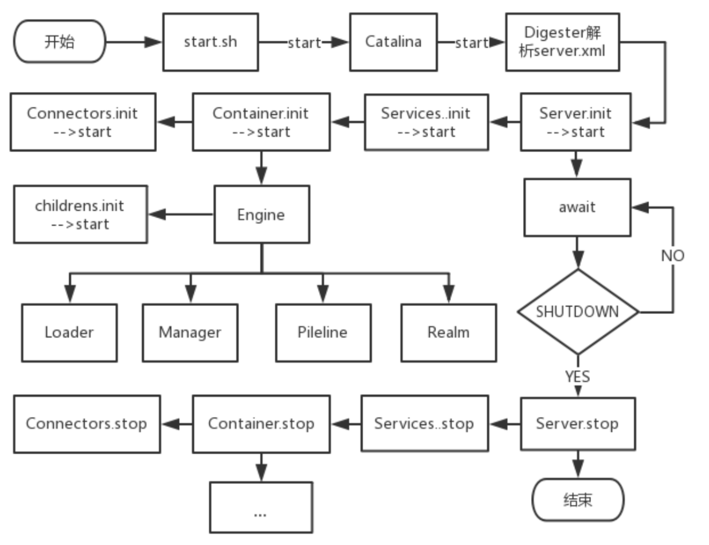
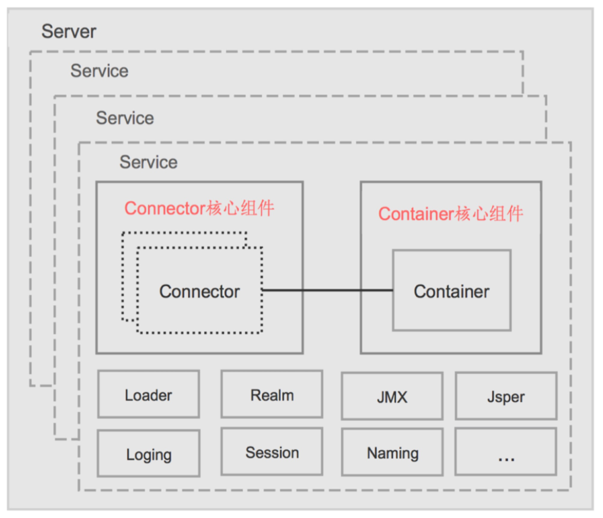
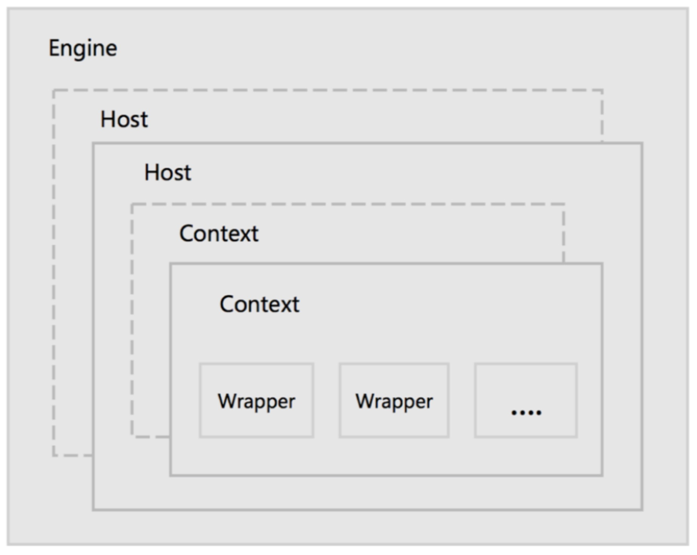
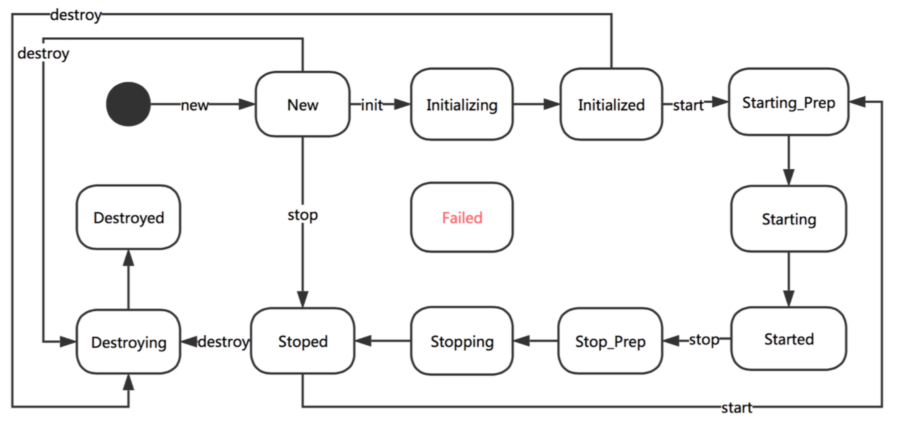
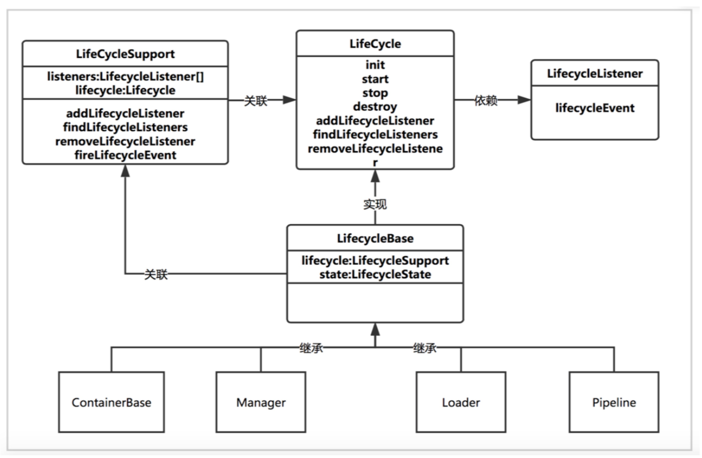
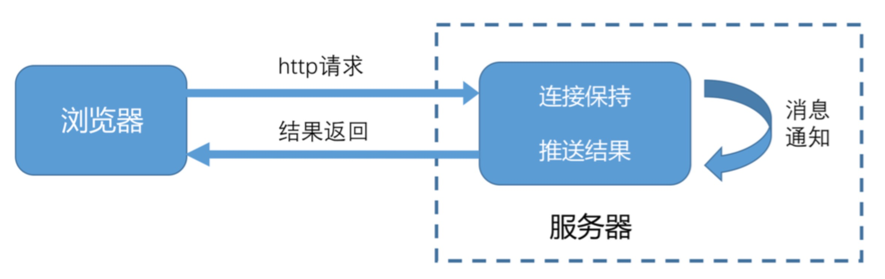

## Apache Tomcat 

网站： http://tomcat.apache.org/

> Apache Tomcat 是一个开源的Web服务器

### 目录
- [启动](#启动)
- [启动过程](#启动过程)
- [关闭](#关闭)
- [配置](#配置)
- [目录结构](#目录结构)
- [架构](#架构)
- [生命周期管理](#生命周期管理)
- 
- [使用中遇到的问题](#使用中遇到的问题)

### 启动

Windows版：
```text
进入bin目录，点击startup.bat启动。
```

### 启动过程



- 启动从 Tomcat 提供的 start.sh 脚本开始，shell 脚本会调用 Bootstrap 的 main 方法，实际 调用了 Catalina 相应的 load、start 方法。
- load 方法会通过 Digester 进行 config/server.xml 的解析，在解析的过程中会根据 xml 中的关系 和配置信息来创建容器，并设置相关的属性。接着 Catalina 会调用 StandardServer 的 init 和 start 方法进行容器的初始化和启动。
- 按照 xml 的配置关系，server 的子元素是 service，service 的子元素是顶层容器 Engine，每层容器有持有自己的子容器，而这些元素都实现了生命周期管理 的各个方法，因此就很容易的完成整个容器的启动、关闭等生命周期的管理。
- StandardServer 完成 init 和 start 方法调用后，会一直监听来自 8005 端口(可配置)，如果接收 到 shutdown 命令，则会退出循环监听，执行后续的 stop 和 destroy 方法，完成 Tomcat 容器的 关闭。同时也会调用 JVM 的 Runtime.getRuntime()﴿.addShutdownHook 方法，在虚拟机意外退 出的时候来关闭容器。
- 所有容器都是继承自 ContainerBase，基类中封装了容器中的重复工作，负责启动容器相关的组 件 Loader、Logger、Manager、Cluster、Pipeline，启动子容器(线程池并发启动子容器，通过 线程池 submit 多个线程，调用后返回 Future 对象，线程内部启动子容器，接着调用 Future 对象 的 get 方法来等待执行结果)。


### 关闭

Windows版：
```text
进入bin目录，点击shutdown.bat关闭。
```

### 配置

Windows版：
1. 设置 JAVA_HOME 为 JDK安装路径。 
    - Tomcat就可以根据JAVA_HOME找到JDK，然后启动了。（Tomcat依赖于java）
2. 设置 CATALINA_HOME 为 Tomcat安装路径。
    - 这个环境变量能够让Tomcat在该变量所配置的目录来启动。
    - 可以不配置，如果配置startup.bat根据CATALINA_HOME变量启动Tomcat
    - 设置PATH 添加变量值：%CATALINA_HOME%\lib;%CATALINA_HOME%\bin
3. 配置端口。 进入conf目录，编辑server.xml配置文件。
    ```text
    <Connector port="8080" protocol="HTTP/1.1" connectionTimeout="20000" redirectPort="8443" />
    ```
4. 配置web应用。
    ```text
    <Host name="localhost"  appBase="webapps" unpackWARs="true" autoDeploy="true">
    在Server.xml的<Host>标签中，添加<Context/>标签
    <Context path="/news" docBase="E:\news" />
    或放到缺省目录下： 将文件夹放到 Tomcat/webapps下
    ```
5. war包发送到webapps下，war文件会自动解压，可以直接被访问。

### 目录结构

Windows版：
- bin —— 存放启动和关闭Tomcat的脚本文件。
- conf —— 存放Tomcat服务器的各种配置文件。
- lib —— 存放Tomcat服务器的支撑jar包。
- logs —— 存放Tomcat的日志文件。
- temp —— 存放运行时产生的临时文件。
- webapps —— web应用所在目录，供外界访问的web资源的存放目录。
- work —— Tomcat的工作目录。

### 架构

**Tomcat顶层架构图**，如下：


- Server：指的就是整个 Tomcat 服 务器，包含多组服务，负责管理和 启动各个 Service，同时监听 8005 端口发过来的 shutdown 命令，用 于关闭整个容器 ；
- Service：Tomcat 封装的、对外提 供完整的、基于组件的 web 服务， 包含 Connectors、Container 两个 核心组件，以及多个功能组件，各 个 Service 之间是独立的，但是共享 同一 JVM 的资源 ；
- Connector：Tomcat 与外部世界的连接器，监听固定端口接收外部请求，传递给 Container，并 将 Container 处理的结果返回给外部；
- Container：Catalina，Servlet 容器，内部有多层容器组成，用于管理 Servlet 生命周期，调用 servlet 相关方法。
- Loader：封装了 Java ClassLoader，用于 Container 加载类文件； Realm：Tomcat 中为 web 应用程序提供访问认证和角色管理的机制；
- JMX：Java SE 中定义技术规范，是一个为应用程序、设备、系统等植入管理功能的框架，通过 JMX 可以远程监控 Tomcat 的运行状态；
- Jasper：Tomcat 的 Jsp 解析引擎，用于将 Jsp 转换成 Java 文件，并编译成 class 文件。 Session：负责管理和创建 session，以及 Session 的持久化(可自定义)，支持 session 的集群。
- Pipeline：在容器中充当管道的作用，管道中可以设置各种 valve(阀门)，请求和响应在经由管 道中各个阀门处理，提供了一种灵活可配置的处理请求和响应的机制。
- Naming：命名服务，JNDI， Java 命名和目录接口，是一组在 Java 应用中访问命名和目录服务的 API。命名服务将名称和对象联系起来，使得我们可以用名称访问对象，目录服务也是一种命名 服务，对象不但有名称，还有属性。Tomcat 中可以使用 JNDI 定义数据源、配置信息，用于开发 与部署的分离。

**Container组成**，如下：


- Engine：Servlet 的顶层容器，包含一 个或多个 Host 子容器；
- Host：虚拟主机，负责 web 应用的部 署和 Context 的创建；
- Context：Web 应用上下文，包含多个 Wrapper，负责 web 配置的解析、管 理所有的 Web 资源；
- Wrapper：最底层的容器，是对 Servlet 的封装，负责 Servlet 实例的创 建、执行和销毁。


### 生命周期管理

Tomcat 为了方便管理组件和容器的生命周期，定义了从创建、启动、到停止、销毁共 12 种状态，tomcat 生命周期管理了内部状态变化的规则控制，组件和容器只需实现相应的生命周期 方法即可完成各生命周期内的操作(initInternal、startInternal、stopInternal、 destroyInternal)；

比如执行初始化操作时，会判断当前状态是否 New，如果不是则抛出生命周期异常；是的 话则设置当前状态为 Initializing，并执行 initInternal 方法，由子类实现，方法执行成功则设置当 前状态为 Initialized，执行失败则设置为 Failed 状态；


Tomcat 的生命周期管理引入了事件机制，在组件或容器的生命周期状态发生变化时会通 知事件监听器，监听器通过判断事件的类型来进行相应的操作。

事件监听器的添加可以在 server.xml 文件中进行配置;

Tomcat 各类容器的配置过程就是通过添加 listener 的方式来进行的，从而达到配置逻辑与 容器的解耦。如 EngineConfig、HostConfig、ContextConfig。
- EngineConfig：主要打印启动和停止日志
- HostConfig：主要处理部署应用，解析应用 META-INF/context.xml 并创建应用的 Context 
- ContextConfig：主要解析并合并 web.xml，扫描应用的各类 web 资源 (filter、servlet、listener)



### Comet
    
Comet是一种用于web的推送技术，能使服务器实时地将更新的信息传送到客户端，而无须客户端发出请求

在WebSocket出来之前，如果不适用comet，只能通过浏览器端轮询Server来模拟实现服务器端推送。

Comet支持servlet异步处理IO，当连接上数据可读时触发事件，并异步写数据(阻塞)


Tomcat要实现Comet，只需继承HttpServlet同时，实现CometProcessor接口

- Begin：新的请求连接接入调用，可进行与Request和Response相关的对象初始化操作，并保存response对象，用于后续写入数据
- Read：请求连接有数据可读时调用
- End：当数据可用时，如果读取到文件结束或者response被关闭时则被调用
- Error：在连接上发生异常时调用，数据读取异常、连接断开、处理异常、socket超时

Note：
- Read：在post请求有数据，但在begin事件中没有处理，则会调用read，如果read没有读取数据，在会触发Error回调，关闭socket
- End：当socket超时，并且response被关闭时也会调用；server被关闭时调用
- Error：除了socket超时不会关闭socket，其他都会关闭socket
- End和Error时间触发时应关闭当前comet会话，即调用CometEvent的close方法
- Note：在事件触发时要做好线程安全的操作


### 使用中遇到的问题

- 端口占用问题
    ```text
    使用命令：
        netstat -ano
        
    可以找到占用端口的进程pid，再进入任务管理器，将对应pid的进程关闭。
    如果没有找到pid，在属性显示栏右键勾选pid，即可看到
    ```