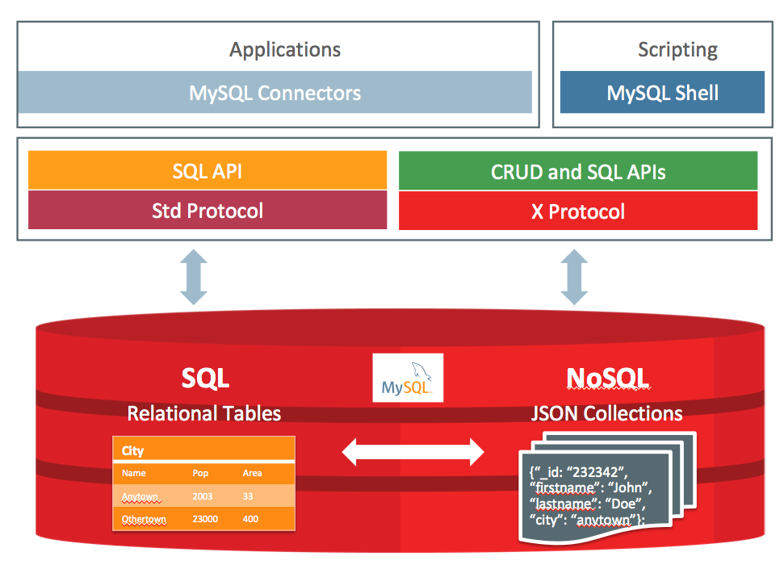
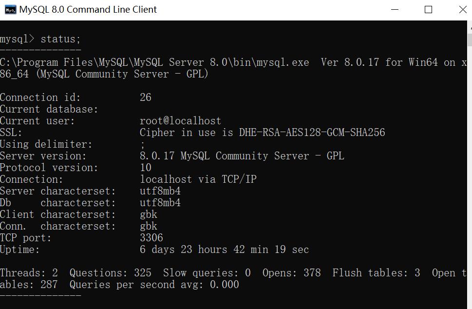
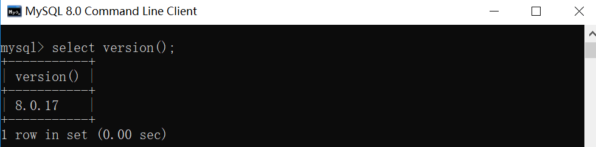

## MySQL

网站： https://www.mysql.com

> MySQL是一个关系型数据库管理系统，开源。
> 由瑞典MySQL AB 公司开发，目前属于 Oracle 旗下产品。
> 
> 最流行的关系型数据库管理系统之一。

### 目录
- [版本](#版本)
- [存储引擎](#存储引擎)
- [MySQL文档存储体系结构](#MySQL文档存储体系结构)
- [优化InnoDB查询](#优化InnoDB查询（在每个表上创建合适的索引）（来自官网）)
- [索引](MySQL-index.md)
- 锁
- 事务
- 分库分表的设计和优化
- [集群方案：读写分离，垂直与水平拆分](MySQL-Cluster.md)
- [查看MySQL版本号-Windows](#查看MySQL版本号)
- [MySQL WorkBench](MySQL-workbench.md)
- [常用SQL](MySQL-sql.md)
    - [SQL日期](MySQL-date.md)
    - [SQL时间](MySQL-time.md)
    - [查询连续登陆天数](MySQL-incessancydays.md)
    - [分析SQL语句](MySQL-explain.md)
    

### 版本
	
	2019-07-22  MySQL 8.0.17

### 存储引擎

- MyISAM

    MySQL5.0之前的默认数据库引擎。拥有较高的插入，查询速度。
    - 不支持行锁(MyISAM只有表锁)，读取时对需要读到的所有表加锁，写入时则对表加排他锁；
    - 不支持事务
    - 不支持外键
    - 不支持崩溃后的安全恢复
    - 在表有读取查询的同时，支持往表中插入新纪录
    - 支持BLOB和TEXT的前500个字符索引，支持全文索引
    - 支持延迟更新索引，极大地提升了写入性能
    - 对于不会进行修改的表，支持 压缩表 ，极大地减少了磁盘空间的占用
    
- InnoDB

    事务型数据库的首选引擎，支持ACID事务，支持行级锁定, MySQL 5.5 起成为默认数据库引擎。
    - 支持了ACID兼容的事务（Transaction）
    - 支持行锁，采用MVCC来支持高并发，有可能死锁
    - 支持外键
    - 支持崩溃后的安全恢复
    - 不支持全文索引

### MySQL文档存储体系结构

MySQL Document Store architecture （来自官网）

### 优化InnoDB查询（在每个表上创建合适的索引）（来自官网）

1.	因为每个InnoDB表都有一个主键(无论是否请求主键)，所以为每个表指定一组主键列，这些列用于最重要和时间关键的查询。

2.	不要在主键中指定太多或太长列，因为这些列值在每个辅助索引中重复。当索引包含不必要的数据时，读取该数据的I/O和缓存该数据的内存会降低服务器的性能和可伸缩性。

3.	不要为每个列创建单独的辅助索引，因为每个查询只能使用一个索引。很少测试的列或只有几个不同值的列上的索引可能对任何查询都没有帮助。如果对同一个表有很多查询，测试不同的列组合，请尝试创建少量的连接索引，而不是大量的单列索引。如果索引包含结果集所需的所有列(称为覆盖索引)，则查询可能完全可以避免读取表数据。

4.	如果索引列不能包含任何空值，则在创建表时将其声明为NOT NULL。当优化器知道每个列是否包含空值时，它可以更好地确定对查询使用哪个索引最有效。

### 查看MySQL版本号

- 命令行模式登录MySQL

- 命令行下使用status

- 使用系统函数

