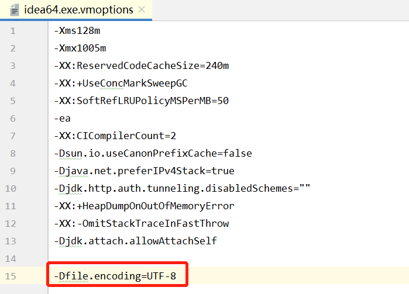
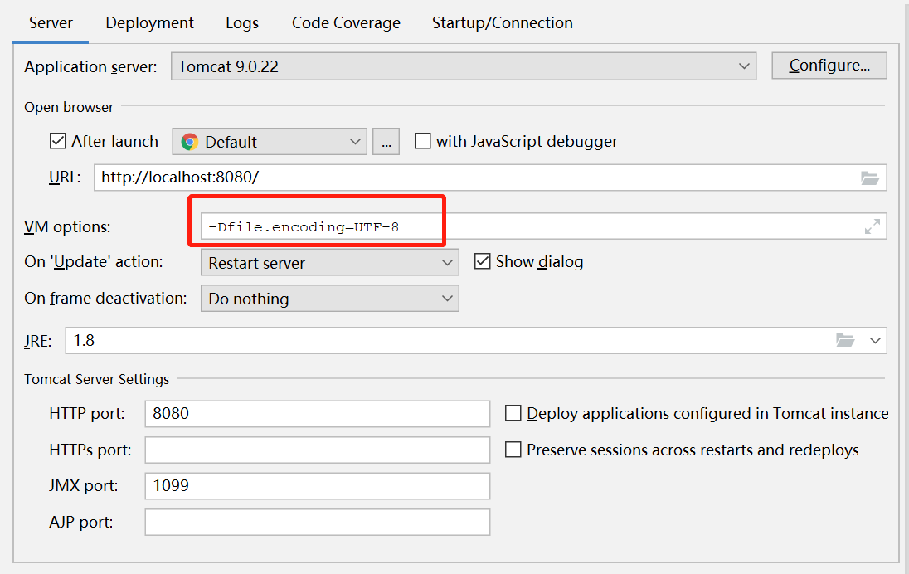
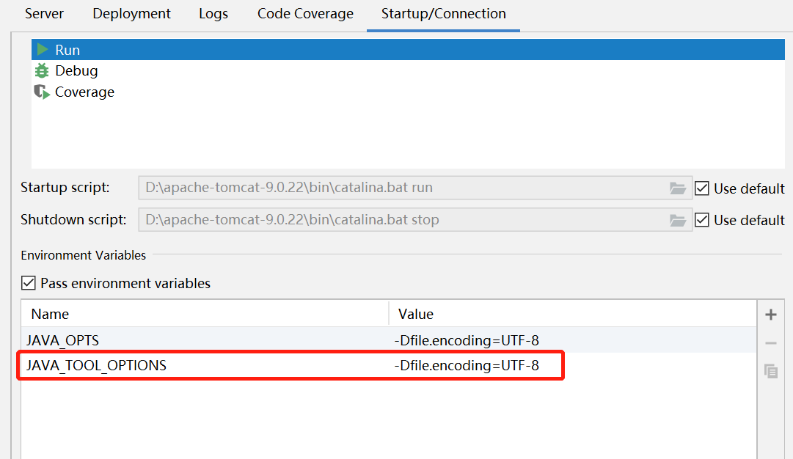

## IDEA tomcat启动控制台乱码

在IDEA中Tomcat启动项目时，可能会在控制台出现中文乱码，可以通过以下方式解决中文乱码问题：

1. 点击Help => Edit custom VM Options，在最后面添加 “-Dfile.encoding=UTF-8”
    
2. 点击右上角 Edit Configurations，在tomcat配置中的 VM option中添加 “-Dfile.encoding=UTF-8”
    
3.  在第二步的Startup/Connection页签的Run和Debug添加一个key为JAVA_TOOL_OPTIONS， value为-Dfile.encoding=UTF-8的环境变量
    
4. 保存后重启IDEA