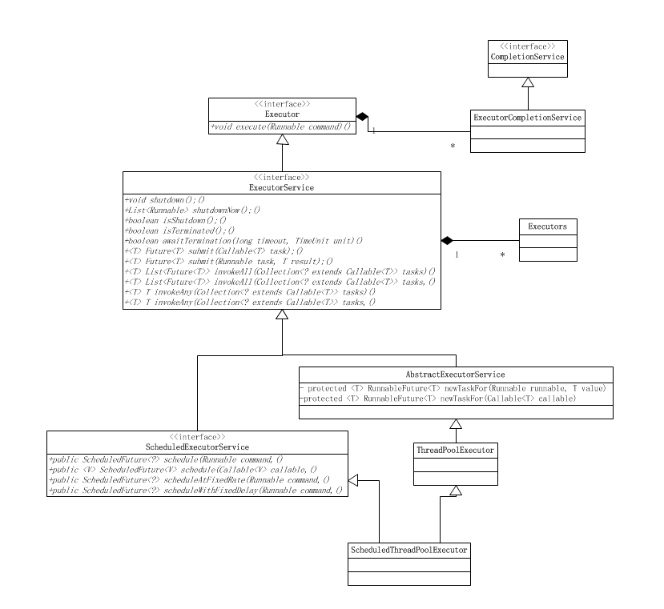

## 多线程

### 进程

程序的一次执行过程，是系统运行程序的基本单元。

### 线程

是一个比进程更小的执行单元。一个进程在其执行的过程中可以产生多个线程。

线程上下文的切换比进程上下文切换要快很多。

Thread 类

常用方法： start() run() sleep()

创建线程：

1.	继承Thread类，重写run() 方法。

2.	实现Runnable 接口，重写run() 方法。

3.	实现Callable接口和Future创建线程，重写call() 方法。任务执行后可返回值，call() 方法可以抛出异常。运行Callable任务可拿到一个Future对象。

注：一般推荐采用实现接口的方式来创建多线程

### 多线程

多个线程同时运行或交替运行。单核CPU顺序执行，也就是交替运行。多核CPU可以同时运行。

一个线程连着调用start两次或多次会出现IllegalThreadStateException异常。

### 线程安全

线程安全就是多线程访问时，采用了加锁机制，当一个线程访问该类的某个数据时，进行保护，其他线程不能进行访问直到该线程读取完，其他线程才可使用。不会出现数据不一致或者数据污染。

### 非线程安全

不提供数据访问保护，有可能出现多个线程先后更改数据造成所得到的数据是脏数据。

### 悲观锁

总是假设最坏的情况，每次去拿数据的时候都认为别人会修改，所以每次在拿数据的时候都会上锁，这样别人想拿这个数据就会阻塞直到它拿到锁（共享资源每次只给一个线程使用，其它线程阻塞，用完后再把资源转让给其它线程）。传统的关系型数据库里边就用到了很多这种锁机制，比如行锁，表锁等，读锁，写锁等，都是在做操作之前先上锁。Java中synchronized和ReentrantLock等独占锁就是悲观锁思想的实现。

场景： 多写，经常产生冲突。

### 乐观锁

总是假设最好的情况，每次去拿数据的时候都认为别人不会修改，所以不会上锁，但是在更新的时候会判断一下在此期间别人有没有去更新这个数据，可以使用版本号机制和CAS算法实现。乐观锁适用于多读的应用类型，这样可以提高吞吐量，像数据库提供的类似于write_condition机制，其实都是提供的乐观锁。在Java中java.util.concurrent.atomic包下面的原子变量类就是使用了乐观锁的一种实现方式CAS实现的。

场景： 写比较少，多读，冲突很少发生的时候。省去了锁的开销，加大了系统的整个吞吐量。

乐观锁常见的两种实现方式: 版本号机制或CAS（Compare-and-Swap，即比较并替换）算法

### 版本号机制

一般是在数据表中加上一个数据版本号version字段，表示数据被修改的次数，当数据被修改时，version值会加一。当线程A要更新数据值时，在读取数据的同时也会读取version值，在提交更新时，若刚才读取到的version值为当前数据库中的version值相等时才更新，否则重试更新操作，直到更新成功。

### CAS算法

即 compare and swap（比较与交换），是一种有名的无锁算法。无锁编程，即不使用锁的情况下实现多线程之间的变量同步，也就是在没有线程被阻塞的情况下实现变量的同步，所以也叫非阻塞同步（Non-blocking Synchronization）。CAS算法涉及到三个操作数
- 需要读写的内存值 V
- 进行比较的值 A
- 拟写入的新值 B

当且仅当 V 的值等于 A时，CAS通过原子方式用新值B来更新V的值，否则不会执行任何操作（比较和替换是一个原子操作）。一般情况下是一个自旋操作，即不断的重试。

### ThreadLocal

线程局部变量。

为每一个使用该变量的线程都提供一个变量值的副本，是每一个线程都可以独立地改变自己的副本，而不会和其它线程的副本冲突。
	
ThreadLocal类提供的方法：
```text
public T get() { }
public void set(T value) { }
public void remove() { }
protected T initialValue() { }
```

常用场景：数据库连接、Session管理。

Hibernate的数据库连接池就是将connection放进threadlocal实现的。

### 线程池

一个容纳多个线程的容器，其中的线程可以反复使用，省去了频繁创建线程对象的操作，无需反复创建线程而消耗过多资源。

**为什么使用线程池？**

线程池主要用来解决线程生命周期开销问题和资源不足问题。通过对多个任务重复使用线程，线程创建的开销就被分摊到了多个任务上了，而且由于在请求到达时线程已经存在，所以消除了线程创建所带来的延迟。这样，就可以立即为请求服务，使用应用程序响应更快。另外，通过适当的调整线程中的线程数目可以防止出现资源不足的情况。



接口：Executor,CompletionService,[ExecutorService](Concurrent/ExecutorService.md)，ScheduledExecutorService

抽象类：AbstractExecutorService

实现类：ExecutorCompletionService，ThreadPoolExecutor，ScheduledThreadPoolExecutor


**使用线程池方式 Runnable接口**

**使用线程池方式 Callable接口**

**Executors提供四种线程池：**

- newCachedThreadPool
    
    创建一个可缓存线程池，如果线程池长度超过处理需要，可灵活回收空闲线程，若无可回收，则新建线程。

- newFixedThreadPool

    创建一个定长线程池，可控制线程最大并发数，超出的线程会在队列中等待，表示同一时刻只能有这么大的并发数

- newScheduledThreadPool

    创建一个定时线程池，支持定时及周期性任务执行。

- newSingleThreadExecutor

    创建一个单线程化的线程池，它只会用唯一的工作线程来执行任务，保证所有任务按照指定顺序(FIFO, LIFO, 优先级)执行。


线程池不建议使用Executors去创建，而是通过ThreadPoolExecutor的方式，这样的处理方式让写的同学更加明确线程池的运行规则，规避资源耗尽的风险。

**Executors提供和线程池的弊端：**

1. newFixedThreadPool和newSingleThreadExecutor: 主要问题是堆积的请求处理队列可能会耗费非常大的内存，甚至OOM。

2. newCachedThreadPool和newScheduledThreadPool: 主要问题是线程数最大数是Integer.MAX_VALUE，可能会创建数量非常多的线程，甚至OOM

**ThreadPoolExecutor线程池的重要参数**

- int corePoolSize：
    - 线程池中核心线程数的最大值。
	- 核心线程会一直存活，及时没有任务需要执行
	- 当线程数小于核心线程数时，即使有线程空闲，线程池也会优先创建新线程处理
	- 设置allowCoreThreadTimeout=true（默认false）时，核心线程会超时关闭

- queueCapacity：
	- 任务队列容量（阻塞队列）
	- 当核心线程数达到最大时，新任务会放在队列中排队等待执行

- int maxPoolSize：
	- 最大线程数
	- 当线程数>=corePoolSize，且任务队列已满时。线程池会创建新线程来处理任务
	- 当线程数=maxPoolSize，且任务队列已满时，线程池会拒绝处理任务而抛出异常

- keepAliveTime：线程空闲时间
	- 当线程空闲时间达到keepAliveTime时，线程会退出，直到线程数量=corePoolSize
	- 如果allowCoreThreadTimeout=true，则会直到线程数量=0

- allowCoreThreadTimeout：
	- 允许核心线程超时

- rejectedExecutionHandler：
	- 任务拒绝处理器
	- 两种情况会拒绝处理任务：
		- 当线程数已经达到maxPoolSize，切队列已满，会拒绝新任务
		- 当线程池被调用shutdown()后，会等待线程池里的任务执行完毕，再shutdown。如果在调用shutdown()和线程池真正shutdown之间提交任务，会拒绝新任务
		- 线程池会调用rejectedExecutionHandler来处理这个任务。如果没有设置默认是AbortPolicy，会抛出异常
		- ThreadPoolExecutor类有几个内部实现类来处理这类情况：
			- AbortPolicy 丢弃任务，抛运行时异常
			- CallerRunsPolicy 执行任务
			- DiscardPolicy 忽视，什么都不会发生
			- DiscardOldestPolicy 从队列中踢出最先进入队列（最后一个执行）的任务
		- 实现RejectedExecutionHandler接口，可自定义处理器

**ThreadPoolExecutor线程池的执行顺序：**

1. 当线程数小于核心线程数时，创建线程。

2. 当线程数大于等于核心线程数，且任务队列未满时，将任务放入任务队列。

3. 当线程数大于等于核心线程数，且任务队列已满

    - 若线程数小于最大线程数，创建线程

    - 若线程数等于最大线程数，抛出异常，拒绝任务

**线程池的关闭：**

ThreadPoolExecutor提供了两个方法，用于线程池的关闭，分别是shutdown()和shutdownNow()，其中：

shutdown()：不会立即终止线程池，而是要等所有任务缓存队列中的任务都执行完后才终止，但再也不会接受新的任务

shutdownNow()：立即终止线程池，并尝试打断正在执行的任务，并且清空任务缓存队列，返回尚未执行的任务

### [并发框架 LMAX Disruptor](Concurrent/LMAX-Disruptor.md)

### Java协程（quasar）

协程是在单线程中的多个任务同时执行的相互配合，避免了线程之间切换造成的资源浪费

**协程的基本原理是：**

在某个点挂起当前的任务，并且保存栈信息，去执行另一个任务；等完成或达到某个条件时，在还原原来的栈信息并继续执行。

JVM原生是不支持这样的操作，如果要在纯java代码里需要使用协程的话需要引入第三方包，如Quasar。

Quasar原理：

1. 利用字节码增强，将普通的java代码转换为支持协程的代码。

2. 在调用pausable方法的时候，如果pause了就保存当前方法栈的State，停止执行当前协程，将控制权交给调度器

3. 调度器负责调度就绪的协程

4. 协程resume的时候，自动恢复State，根据协程的pc计数跳转到上次执行的位置，继续执行。

**Java协程-Quasar的使用：**

- 依赖Jar包

```xml
<dependency>
  <groupId>co.paralleluniverse</groupId>
  <artifactId>quasar-core</artifactId>
  <version>0.7.10</version>
  <classifier>jdk8</classifier>
</dependency>
```


[**返回首页目录**](../README.md)
