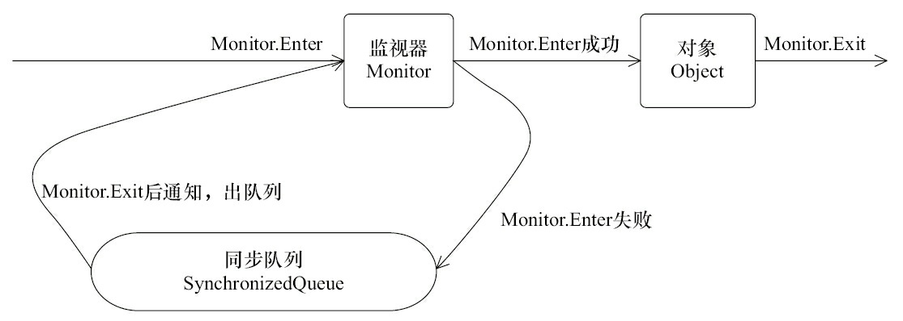

## 多线程

#### 简述线程，程序、进程的基本概念。以及他们之间关系是什么？
     
线程与进程相似，但线程是一个比进程更小的执行单位。一个进程在其执行的过程中可以产生多个线程。与进程不同的是同类的多个线程共享同一块内存空间和一组系统资源，所以系统在产生一个线程，或是在各个线程之间作切换工作时，负担要比进程小得多，也正因为如此，线程也被称为轻量级进程。

程序是含有指令和数据的文件，被存储在磁盘或其他的数据存储设备中，也就是说程序是静态的代码。

进程是程序的一次执行过程，是系统运行程序的基本单位，因此进程是动态的。系统运行一个程序即是一个进程从创建，运行到消亡的过程。简单来说，一个进程就是一个执行中的程序，它在计算机中一个指令接着一个指令地执行着，同时，每个进程还占有某些系统资源如CPU时间，内存空间，文件，文件，输入输出设备的使用权等等。换句话说，当程序在执行时，将会被操作系统载入内存中。

线程是进程划分成的更小的运行单位。线程和进程最大的不同在于基本上各进程是独立的，而各线程则不一定，因为同一进程中的线程极有可能会相互影响。从另一角度来说，进程属于操作系统的范畴，主要是同一段时间内，可以同时执行一个以上的程序，而线程则是在同一程序内几乎同时执行一个以上的程序段。

线程上下文的切换比进程上下文切换要快很多：
- 进程切换时，涉及到当前进程的CPU环境的保存和新被调度运行进程的CPU环境的设置。
- 线程切换仅需要保存和设置少量的寄存器内容，不涉及存储管理方面的操作。

#### 线程有哪些基本状态？这些状态是如何定义的?

Java 线程在运行的生命周期中的指定时刻只可能处于下面 6 种不同状态的其中一个状态（图源《Java 并发编程艺术》4.1.4 节）。


线程在生命周期中并不是固定处于某一个状态而是随着代码的执行在不同状态之间切换。Java 线程状态变迁如下图所示（图源《Java 并发编程艺术》4.1.4 节）：


由上图可以看出：线程创建之后它将处于 NEW（新建） 状态，调用 start() 方法后开始运行，线程这时候处于 READY（可运行） 状态。可运行状态的线程获得了 CPU 时间片（timeslice）后就处于 RUNNING（运行） 状态。

当线程执行 wait()方法之后，线程进入WAITING（等待）状态。进入等待状态的线程需要依靠其他线程的通知才能够返回到运行状态，而 TIME_WAITING(超时等待) 状态相当于在等待状态的基础上增加了超时限制，比如通过 sleep（long millis）方法或 wait（long millis）方法可以将 Java 线程置于 TIMED WAITING 状态。当超时时间到达后 Java 线程将会返回到 RUNNABLE 状态。当线程调用同步方法时，在没有获取到锁的情况下，线程将会进入到 BLOCKED（阻塞） 状态。线程在执行 Runnable 的run()方法之后将会进入到 TERMINATED（终止） 状态。


#### 什么是多线程

多线程就是多个线程同时运行或交替运行。单核CPU的话是顺序执行，也就是交替运行。多核CPU的话，因为每个CPU有自己的运算器，所以在多个CPU中可以同时运行。

#### 为什么要使用多线程？

- 先从总体上来说：
    - 从计算机底层来说：线程可以比作是轻量级的进程，是程序执行的最小单位,线程间的切换和调度的成本远远小于进程。另外，多核 CPU 时代意味着多个线程可以同时运行，这减少了线程上下文切换的开销。
    - 从当代互联网发展趋势来说：现在的系统动不动就要求百万级甚至千万级的并发量，而多线程并发编程正是开发高并发系统的基础，利用好多线程机制可以大大提高系统整体的并发能力以及性能。
- 再深入到计算机底层来探讨：
    - 单核时代： 在单核时代多线程主要是为了提高 CPU 和 IO 设备的综合利用率。举个例子：当只有一个线程的时候会导致 CPU 计算时，IO 设备空闲；进行 IO 操作时，CPU 空闲。我们可以简单地说这两者的利用率目前都是 50%左右。但是当有两个线程的时候就不一样了，当一个线程执行 CPU 计算时，另外一个线程可以进行 IO 操作，这样两个的利用率就可以在理想情况下达到 100%了。
    - 多核时代: 多核时代多线程主要是为了提高 CPU 利用率。举个例子：假如我们要计算一个复杂的任务，我们只用一个线程的话，CPU 只会一个 CPU 核心被利用到，而创建多个线程就可以让多个 CPU 核心被利用到，这样就提高了 CPU 的利用率。

#### Java多线程分类？
     
用户线程：运行在前台，执行具体的任务，如程序的主线程、连接网络的子线程等都是用户线程

守护线程：运行在后台，为其他前台线程服务.也可以说守护线程是JVM中非守护线程的 “佣人”。
- 特点： 一旦所有用户线程都结束运行，守护线程会随JVM一起结束工作
- 应用： 数据库连接池中的检测线程，JVM虚拟机启动后的检测线程
- 最常见的守护线程： 垃圾回收线程
- 设置守护线程：可以通过调用 Thead 类的 setDaemon(true) 方法设置当前的线程为守护线程。
- 注意事项：
    1.  setDaemon(true)必须在start（）方法前执行，否则会抛出IllegalThreadStateException异常
    2. 在守护线程中产生的新线程也是守护线程
    3. 不是所有的任务都可以分配给守护线程来执行，比如读写操作或者计算逻辑

#### 线程的优先级？
     
每个线程都具有各自的优先级，线程的优先级可以在程序中表明该线程的重要性，如果有很多线程处于就绪状态，系统会根据优先级来决定首先使哪个线程进入运行状态。但这个并不意味着低 优先级的线程得不到运行，而只是它运行的几率比较小，如垃圾回收机制线程的优先级就比较低。所以很多垃圾得不到及时的回收处理。

线程优先级具有继承特性。 比如A线程启动B线程，则B线程的优先级和A是一样的。

线程优先级具有随机性。 也就是说线程优先级高的不一定每一次都先执行完。

Thread类中包含的成员变量代表了线程的某些优先级。如Thread.MIN_PRIORITY（常数1），Thread.NORM_PRIORITY（常数5）, Thread.MAX_PRIORITY（常数10）。其中每个线程的优先级都在Thread.MIN_PRIORITY（常数1） 到Thread.MAX_PRIORITY（常数10） 之间，在默认情况下优先级都是Thread.NORM_PRIORITY（常数5）。


#### 1. 创建线程的几种方式？wait sleep分别是谁的方法，区别，线程间的通信方式。
```text
1. 通过继承Thread类实现一个线程
   Java单继承，不适合资源共享。不推荐。
2. 通过实现Runnable接口实现一个线程
   很容易实现资源共享。推荐。
3. 覆写Callable接口实现多线程。
   call() 有返回值。

wait是Object类的方法。
sleep是Thread类的方法。
区别：
    1. sleep 是Thread类的静态方法，调用此方法会让当前线程暂停指定的时间，将执行机会（CPU）让给其他线程，但是不会释放锁，因此休眠时间结束后自动恢复（程序回到就绪状态）。
    2. wait  是Object类的方法，调用对象的wait方法导致线程放弃CPU的执行权，同时也放弃对象的锁（线程暂停执行），进入对象的等待池（wait pool），只有调用对象的notify或notifyAll方法才能唤醒等待池中的线程进入等锁池（lock pool），如果线程重新获得对象的锁就可以进入就绪状态。
    3. wait notify和notifyAll 只能在同步控制方法中或者同步控制块中使用，而sleep可以在任何地方使用。
    4. sleep必须捕获异常，而wait，notify和notifyAll不需要捕获异常。

线程之间的通信方式：
分布式系统中说的两种通信机制：共享内存机制和消息通信机制。
    1. 消息队列。 常用，灵活。
       通过自定义数据结构，可以传输复杂和简单的数据结构。
    2. 使用全局变量。常用。
       定义全局变量时最好使用volatile来定义，以防编译器对此变量进行优化。
    3. 使用事件CEvent类实现线程间通信。
       CEvent对象有两种状态：有信号和无信号，线程可以监视处于有信号状态的事件，以便在适当的时候执行对事件的操作。

```

##### ①继承Thread类
```text
MyThread.java
public class MyThread extends Thread {
    @Override
    public void run() {
        super.run();
        System.out.println("MyThread");
    }
}

Run.java
public class Run {
 
    public static void main(String[] args) {
        MyThread mythread = new MyThread();
       mythread.start();
        System.out.println("运行结束");
    }
 
}

```
运行结果： 
```text
运行结束
MyThread
```
从上面的运行结果可以看出：线程是一个子任务，CPU以不确定的方式，或者说是以随机的时间来调用线程中的run方法。

##### ②实现Runnable接口
推荐实现Runnable接口方式开发多线程，因为Java单继承但是可以实现多个接口。

```text
MyRunnable.java
public class MyRunnable implements Runnable {
  @Override
  public void run() {
     System.out.println("MyRunnable");
  }
}
Run.java
public class Run {

  public static void main(String[] args) {
     Runnable runnable=new MyRunnable();
     Thread thread=new Thread(runnable);
     thread.start();
     System.out.println("运行结束！");
  }

}

```
运行结果：  
```text
运行结束！
MyRunnable
```

##### ③使用线程池
在《阿里巴巴Java开发手册》“并发处理”这一章节，明确指出线程资源必须通过线程池提供，不允许在应用中自行显示创建线程。

为什么呢？

使用线程池的好处是减少在创建和销毁线程上所消耗的时间以及系统资源开销，解决资源不足的问题。如果不使用线程池，有可能会造成系统创建大量同类线程而导致消耗完内存或者“过度切换”的问题。

另外《阿里巴巴Java开发手册》中强制线程池不允许使用 Executors 去创建，而是通过 ThreadPoolExecutor 的方式，这样的处理方式让写的同学更加明确线程池的运行规则，规避资源耗尽的风险

Executors 返回线程池对象的弊端如下：
- FixedThreadPool 和 SingleThreadExecutor ： 允许请求的队列长度为 Integer.MAX_VALUE,可能堆积大量的请求，从而导致OOM。
- CachedThreadPool 和 ScheduledThreadPool ： 允许创建的线程数量为 Integer.MAX_VALUE ，可能会创建大量线程，从而导致OOM。


#### 为什么我们调用start()方法时会执行run()方法，为什么我们不能直接调用run()方法？

new一个Thread，线程进入了新建状态;调用start()方法，会启动一个线程并使线程进入了就绪状态，当分配到时间片后就可以开始运行了。 start()会执行线程的相应准备工作，然后自动执行run()方法的内容，这是真正的多线程工作。 而直接执行run()方法，会把run方法当成一个main线程下的普通方法去执行，并不会在某个线程中执行它，所以这并不是多线程工作。

总结： 调用start方法方可启动线程并使线程进入就绪状态，而run方法只是thread的一个普通方法调用，还是在主线程里执行。


#### 2. 死锁，怎么排查死锁？
```text
死锁： 
    两个或两个以上的进程(或线程)在执行过程中，由于竞争资源或者是彼此通信而造成的一种阻塞的现象。
    若无外力作用，它们都将无法推进下去。
    此时称系统处于死锁状态或系统产生了死锁，这些永远在互相等待的进程称为死锁进程。
可能原因：
    1. 锁的嵌套（也包括多线程并发锁嵌套问题）。临界变量。
    2. 中断操作 锁没有释放。
    3. 系统资源不足。
    4. 进程运行推进的顺序不合适。
    5. 资源分配不当。

排查死锁：
    1. Jconsole“检测死锁”。 JDK自带的图形化界面工具
    2. 利用 jstack 定位死锁。JDK自带的命令行工具，主要用于线程Dump分析。
    3. 查看CPU占用。
    4. 压力测试使用jstack找到系统的代码性能问题。

死锁的处理方法：
    1. 从性能出发，优化SQL
    2. 从业务逻辑出发，看能不能去掉竞争资源的关联。
    3. try catch 等一会儿再执行。

```

#### 3. 创建线程池的几种方式，线程池有什么好处？
```text
Java通过Executors提供了四个静态方法创建线程池：
    1. newCachedThreadPool 创建一个可缓存线程池，如果线程池长度超过处理需要，可灵活回收空闲线程，若无可回收，则创建新线程。
    2. newfixedThreadPool 创建一个定长线程池，可控制线程最大并发量，超出的线程会在队列中等待。
    3. newScheduledThreadPool 创建一个定长线程池，支持定时及周期性任务执行。
    4. newSingleThreadExecutor 创建一个单线程化的线程池，它只会用唯一的工作线程来执行任务，保证所有任务按照指定顺序（FIFO,LIFO,优先级）执行。

线程池的作用？
    1. 限定线程的个数，不会由于线程过多，导致系统运行缓慢或崩溃。
    2. 线程池不需要每次都去创建或销毁，节约了资源。
    3. 响应时间更快。

```

#### 4. 线程继承和接口的区别，接口有什么好处？
```text
类似问题1 创建线程的几种方式。
1. 通过继承Thread类，重写Thread的run()方法，将线程运行的逻辑放在其中。
2. 通过实现Runnable接口，实例化Thread类。

实现Runnable接口 相对于继承Thread类来说，有如下优势：
1. 适合多个相同程序代码的线程去处理同一资源的情况。
2. 避免由于Java的单继承特性带来的局限性。扩展性好。
3. 增强了程序的健壮性，代码能够被多个线程共享，代码与数据是独立的。资源共享。

```

#### 5. Synchronized  lock reentrantLock，区别，用法，原理。
```text
共同点： 加锁方式同步，阻塞式同步。都是可重入锁。
    
区别：
    Synchronized 同步
        1. 是java语言的关键字，是原生语法层面的互斥，需要jvm实现。
        2. 便利性：使用比较简洁，并且由编译器去保证锁的加锁和释放。
           在发生异常时，会自动释放线程占有的锁，因此不会导致死锁现象发生。
        3. 不如ReentrantLock灵活。
            ①. 等待的线程会一直等待下去，不能够响应中断。
            ②. 无法判断锁的状态。
        4. 性能：Synchronized引入了偏向锁，轻量级锁（自旋锁）后，性能与ReentrantLock差不多。
        5. 悲观锁。
    Lock 锁
        1. Lock是一个类，接口，通过这个类可以实现同步访问。
        2. 需要手动释放锁。
        3. 乐观锁。
    ReentrantLock 可重入锁
        1. 是唯一实现了Lock接口的类，并且ReentrantLock提供了更多的方法
        1. 是JDK 1.5之后提供的API层面的互斥锁，需要lock()和unlock()方法配合try/finally语句块来完成。
        2. 便利性：需要手工声明来加锁和释放锁。
           为了避免忘记手工释放锁造成死锁，所以最好在finally中声明释放锁。
        3. 更灵活。
            ①. ReentrantLock可以指定是公平锁还是非公平锁。而synchronized只能是非公平锁。所谓的公平锁就是先等待的线程先获得锁。
            ②. ReentrantLock提供了一个Condition（条件）类，用来实现分组唤醒需要唤醒的线程们，而不是像synchronized要么随机唤醒一个线程要么唤醒全部线程。
            ③. ReentrantLock提供了一种能够中断等待锁的线程的机制，通过lock.lockInterruptibly()来实现这个机制。
            ④. 可以判断锁的状态，知道有没有成功获取锁。
            ⑤. 锁等待时间。
            ⑥. 快速轮询。
        4. 性能高。可以提高多个线程进行读操作的效率。

```

Synchronized 底层实现：
```text
    synchronized映射成字节码指令就是增加来两个指令：monitorenter和monitorexit。
    当一条线程进行执行的遇到monitorenter指令的时候，它会去尝试获得锁，如果获得锁那么锁计数+1（为什么会加一呢，因为它是一个可重入锁，所以需要用这个锁计数判断锁的情况），如果没有获得锁，那么阻塞。
    当它遇到monitorexit的时候，锁计数器-1，当计数器为0，那么就释放锁。
    释放锁有两种机制：一种就是执行完释放；另外一种就是发送异常，虚拟机释放。
    
    底层实现的另一种解释：synchronized关键字需要一个引用类型的参数，这个参数也叫做监听器（monitor）；
    JVM通过这个监听器来管理所有需要同步的线程（synchronized这个监听器的所有线程）运行状态，
    成功占有该monitor的线程即成为该监听器的owner，其他线程则被状态切换至阻塞状态并维护在一个队列中准备下一次的竞争。
    
    尽可能用Synchronized， 原因是Synchronized优化了：
    1. 线程自旋和适应性自旋。
    2. 锁消除。把不必要的同步在编译阶段进行移除。
    3. 锁粗化。
    4. 轻量级锁。
    5. 偏向锁。
```
对象、监视器、同步队列和执行线程间的关系如下图：


synchronized的使用场景： 
```text
①方法同步  public synchronized void method1
②代码块同步 synchronized(this){ //TODO }
③方法同步  public synchronized static void method3
④代码块同步 synchronized(Test.class){ //TODO}
⑤代码块同步 synchronized(o) {}


```

ReentrantLock实现的原理：
```text
    ReentrantLock的实现是一种自旋锁，通过循环调用CAS操作来实现加锁。
    它的性能比较好也是因为避免了使线程进入内核态的阻塞状态。

```


ReentrantLock的用法：
```java
public class SynDemo{
	public static void main(String[] arg){
		Runnable t1=new MyThread();
		new Thread(t1,"t1").start();
		new Thread(t1,"t2").start();
	}
}
class MyThread implements Runnable { 
	private Lock lock=new ReentrantLock();
	public void run() {
		lock.lock();
		try{
			for(int i=0;i<5;i++)
				System.out.println(Thread.currentThread().getName()+":"+i);
		}finally{
			lock.unlock();
		}
	}
}
```

#### 6. CountDownLatch 与 CyclicBarrier 用法
帮助Java并发编程。

1. CountDownLatch用法 
    
    CountDownLatch类位于java.util.concurrent包下，利用它可以实现类似计数器的功能。。
    
    构造器：
    ```text
       public CountDownLatch(int count) {  };  //参数count为计数值
    ```
    
    重要的方法：
    ```text
       public void await() throws InterruptedException { };   //调用await()方法的线程会被挂起，它会等待直到count值为0才继续执行
       public boolean await(long timeout, TimeUnit unit) throws InterruptedException { };  //和await()类似，只不过等待一定的时间后count值还没变为0的话就会继续执行
       public void countDown() { };  //将count值减1
    ```

2. CyclicBarrier用法
    
    字面意思回环栅栏，通过它可以实现让一组线程等待至某个状态之后再全部同时执行。
    叫做回环是因为当所有等待线程都被释放以后，CyclicBarrier可以被重用。
    我们暂且把这个状态就叫做barrier，当调用await()方法之后，线程就处于barrier了。
    
    CyclicBarrier类位于java.util.concurrent包下，CyclicBarrier提供2个构造器：
    ```text
       // 参数parties指让多少个线程或者任务等待至barrier状态；参数barrierAction为当这些线程都达到barrier状态时会执行的内容。
       public CyclicBarrier(int parties, Runnable barrierAction) {}    
       public CyclicBarrier(int parties) {}
    ```
    
    CyclicBarrier中最重要的方法就是await方法，它有2个重载版本：
    ```text
       // 常用，用来挂起当前线程，直至所有线程都到达barrier状态再同时执行后续任务；
       public int await() throws InterruptedException, BrokenBarrierException { };
       // 让这些线程等待至一定的时间，如果还有线程没有到达barrier状态就直接让到达barrier的线程执行后续任务。
       public int await(long timeout, TimeUnit unit)throws InterruptedException,BrokenBarrierException,TimeoutException { };
    ```

3. Semaphore用法
    
    Semaphore翻译成字面意思为 信号量，Semaphore可以控同时访问的线程个数，通过 acquire() 获取一个许可，如果没有就等待，而 release() 释放一个许可。
    
    Semaphore类位于java.util.concurrent包下，它提供了2个构造器：
    ```text
       public Semaphore(int permits) {          //参数permits表示许可数目，即同时可以允许多少线程进行访问
           sync = new NonfairSync(permits);
       }
       public Semaphore(int permits, boolean fair) {    //这个多了一个参数fair表示是否是公平的，即等待时间越久的越先获取许可
           sync = (fair)? new FairSync(permits) : new NonfairSync(permits);
       }
    ```
    
    Semaphore类中比较重要的几个方法，首先是acquire()、release()方法：
    ```text
       public void acquire() throws InterruptedException {  }     //获取一个许可，若无许可能够获得，则会一直等待，直到获得许可。
       public void acquire(int permits) throws InterruptedException { }    //获取permits个许可
       public void release() { }          //释放一个许可。 注意，在释放许可之前，必须先获获得许可。
       public void release(int permits) { }    //释放permits个许可
    ```
    
    这4个方法都会被阻塞，如果想立即得到执行结果，可以使用下面几个方法：
    
    ```text
       public boolean tryAcquire() { };    //尝试获取一个许可，若获取成功，则立即返回true，若获取失败，则立即返回false
       public boolean tryAcquire(long timeout, TimeUnit unit) throws InterruptedException { };  //尝试获取一个许可，若在指定的时间内获取成功，则立即返回true，否则则立即返回false
       public boolean tryAcquire(int permits) { }; //尝试获取permits个许可，若获取成功，则立即返回true，若获取失败，则立即返回false
       public boolean tryAcquire(int permits, long timeout, TimeUnit unit) throws InterruptedException { }; //尝试获取permits个许可，若在指定的时间内获取成功，则立即返回true，否则则立即返回false
    ```
    下面对上面说的三个辅助类进行一个总结：
    
    1）CountDownLatch和CyclicBarrier都能够实现线程之间的等待，只不过它们侧重点不同：
    
    CountDownLatch一般用于某个线程A等待若干个其他线程执行完任务之后，它才执行；
    
    而CyclicBarrier一般用于一组线程互相等待至某个状态，然后这一组线程再同时执行；
    
    另外，CountDownLatch是不能够重用的，而CyclicBarrier是可以重用的。
    
    2）Semaphore其实和锁有点类似，它一般用于控制对某组资源的访问权限。


#### 7. volatile关键字的作用和原理

一旦一个共享变量（类的成员变量、类的静态成员变量）被volatile修饰以后，就具备了两次语义：
- 保证了不同线程对这个变量进行操作时的可见性，即一个线程修改了某个变量的值，这新值对其他线程来说是立即可见的。但不能保证原子性。
- 禁止进行指令重排序。

volatile的原理和实现机制。下面这段话摘自《深入理解Java虚拟机》：“观察加入volatile关键字和没有加入volatile关键字时所生成的汇编代码发现，加入volatile关键字时，会多出一个lock前缀指令”。

lock前缀指令实际上相当于一个内存屏障（也成内存栅栏），内存屏障会提供3个功能：
- 它确保指令重排序时不会把其后面的指令排到内存屏障之前的位置，也不会把前面的指令排到内存屏障的后面；即在执行到内存屏障这句指令时，在它前面的操作已经全部完成；
- 它会强制将对缓存的修改操作立即写入主存；
- 如果是写操作，它会导致其他CPU中对应的缓存行无效。


#### 8. 乐观锁和悲观锁

悲观锁：假设一定会发生并发冲突，通过阻塞其他所有线程来保证数据的完整性。

乐观锁：假设不会发生并发冲突，直接不加锁去完成某项更新，如果冲突就返回失败。

乐观锁的一种实现方式-CAS(Compare and Swap 比较并交换)

#### 9. 对公平锁，非公平锁，可重入锁，自旋锁，读写锁的理解。
公平锁：加锁前先查看是否有排队等待的线程，有的话优先处理排在前面的线程，先来先得。

非公平所：线程加锁时直接尝试获取锁，获取不到就自动到队尾等待。

可重入锁： 当一个线程得到一个对象后，再次请求该对象锁时是可以再次得到该对象的锁的。
           具体概念就是：自己可以再次获取自己的内部锁。
           Java里面内置锁(synchronized)和Lock(ReentrantLock)都是可重入的。

自旋锁（spinlock）：是指当一个线程在获取锁的时候，如果锁已经被其它线程获取，那么该线程将循环等待，然后不断的判断锁是否能够被成功获取，直到获取到锁才会退出循环。

读写锁： 实际是一种特殊的自旋锁，它把对共享资源的访问者划分成读者和写者，读者只对共享资源进行读访问，写者则需要对共享资源进行写操作。这种锁相对于自旋锁而言，能提高并发性，因为在多处理器系统中，它允许同时有多个读者来访问共享资源，最大可能的读者数为实际的逻辑CPU数。写者是排他性的，一个读写锁同时只能有一个写者或多个读者（与CPU数相关），但不能同时既有读者又有写者。

#### 10. CAS是什么，底层原理
乐观锁的一种实现方式-CAS(Compare and Swap 比较并交换)

在计算机科学中，比较和交换（Conmpare And Swap）是用于实现多线程同步的原子指令。 它将内存位置的内容与给定值进行比较，只有在相同的情况下，将该内存位置的内容修改为新的给定值。 这是作为单个原子操作完成的。 原子性保证新值基于最新信息计算; 如果该值在同一时间被另一个线程更新，则写入将失败。 操作结果必须说明是否进行替换; 这可以通过一个简单的布尔响应（这个变体通常称为比较和设置），或通过返回从内存位置读取的值来完成（摘自维基本科）
 

#### 11. ArrayBlockingQueue ， LinkedBlockingQueue， SynchronousQueue等堵塞队列的理解。
- LinkedBlockingQueue
    
    LinkedBlockingQueue是使用比较多的队列，在SingleThreadPool(单个线程的线程池)、FixedThreadPool（固定线程数的线程池）使用的都是LinkedBlockingQueue。
    
    在LinkedBlockingQueue中有两个ReentrantLock，takeLock和putLock分别是在添加元素和取出元素的时候添加的锁。
    
    LinkedBlockingQueue是无界队列。
    
- ArrayBlockingQueue
    
    ArrayBlockingQueue是有界队列,在阿里的开源框架RocketMq中就使用到了，其添加和获取都是用的同一个ReentrantLock。
    
- SynchronousQueue

    SynchronousQueue是只有一个元素的队列
    
    - 添加和获取方法都用到了transfer方法。其实是根据是否有元素来区分是添加元素还是获取元素。
    ```text
    public boolean offer(E e) {
        if (e == null) throw new NullPointerException();
        return transferer.transfer(e, true, 0) != null;
    }
    
    public E take() throws InterruptedException {
        E e = transferer.transfer(null, false, 0);
        if (e != null)
            return e;
        Thread.interrupted();
        throw new InterruptedException();
    }
    ```
    - 有两种元素添加获取方式，非公平获取和公平获取
        
        非公平用的是TransferStack，是后进先出的方式
        
        公平方式用的是TransferQueue，是先进先出方式
    - 加锁是用的CAS的方式替换
        
        使用场景：在CachedThreadPool线程池中，使用到了SynchronousQueue。
- ConcurrentLinkedQueue
    
    ConcurrentLinkedQueue数据结构进行了非常巧妙的设计，在添加是从tail节点，获取是从head节点，而且做到了方并发，因为不用锁，所以效率更高。
    
    在netty的读取byteBuffer和获取Selector中都用了ConcurrentLinkedQueue。
- LinkedTransferQueue

    LinkedTransferQueue是jdk才出现的队列，是LinkedBlockingQueue、SynchronousQueue、ConcurrentLinkedQueue的超集，实现了他们三个的功能，其添加和获取都是用的xfer方法。


#### 12. ThreadPoolExecutor的传入参数及内部工作原理。
线程池执行器
ThreadPoolExecutor位于java.util.concurrent包，有4个带参数的构造方法。最终被调用的构造方法如下。其他构造方法只是提供了默认的ThreadFactory或者RejectedExecutionHandler作为参数。
```text
public ThreadPoolExecutor(int corePoolSize,  //  核心线程的数量 当有新任务来到，当前运行的线程数少于corePoolSize的时候，ThreadPoolExecutor二话不说就启动一个新的线程来执行这个任务。
                              int maximumPoolSize,  // 最大可运行的线程数量。当前运行的线程数量大于等于maximumPoolSize时，ThreadPoolExecutor将不会再创建新的线程。
                              long keepAliveTime,  // 核心线程池等待时长限制。
                              TimeUnit unit,   // keepAliveTime的时间单位
                              BlockingQueue<Runnable> workQueue,
                              ThreadFactory threadFactory,
                              RejectedExecutionHandler handler)
```

ThreadPoolExecutor的主要逻辑是，当用户调用execute(Runnable command) ，大致逻辑如下：
1.  查看当前运行状态，如果不是RUNNING状态，将直接拒绝新任务。否则进入步骤2。
2.  查看当前运行线程的数量，如果数量少于核心线程数，将直接创建新的线程执行该任务。否则进入步骤3。
3.  将该任务添加到阻塞队列，等待核心线程执行完上一个任务再来获取。如果添加到阻塞队列失败，进入步骤4。
4.  尝试创建一个非核心线程执行该任务，前提是线程的数量少于等于最大线程数。如果失败，拒绝该任务。

#### 13. 分布式环境下，怎么保证线程安全。
- 基于数据库实现的分布式锁
- 基于排他锁实现的分布式锁
- 基于缓存的分布式锁（Redis，memcached等）
- 使用Zookeeper实现分布式锁

