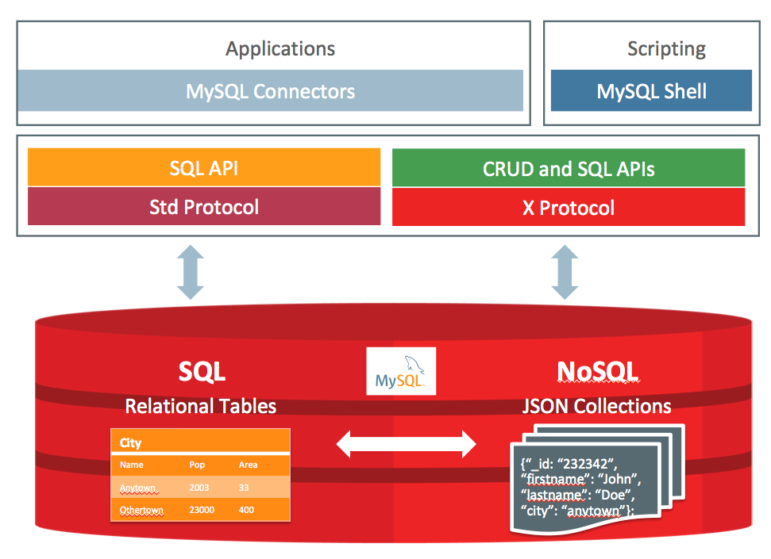
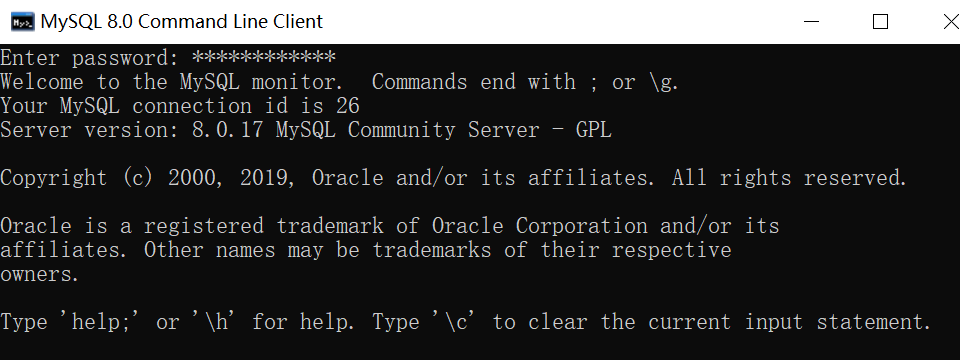
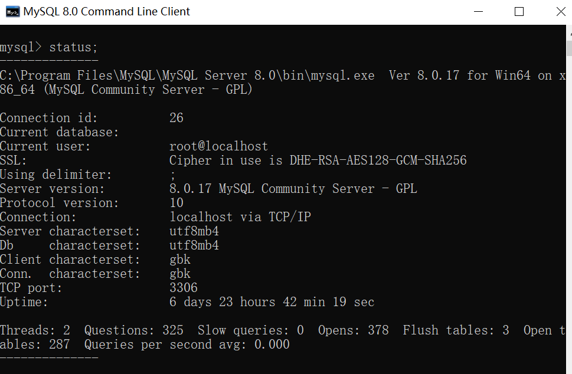

## MySQL

MySQL是一个关系型数据库管理系统，开发源码。

#### 存储引擎：

- MyISAM

    MySQL5.0之前的默认数据库引擎。拥有较高的插入，查询速度，但不支持事务。
    
- InnoDB

    事务型数据库的首选引擎，支持ACID事务，支持行级锁定, MySQL 5.5 起成为默认数据库引擎。

#### MySQL版本：
	
	2019-07-22  MySQL 8.0.17

#### MySQL文档存储体系结构

MySQL Document Store architecture （来自官网）

#### 优化InnoDB查询（在每个表上创建合适的索引）（来自官网）

1.	因为每个InnoDB表都有一个主键(无论是否请求主键)，所以为每个表指定一组主键列，这些列用于最重要和时间关键的查询。

2.	不要在主键中指定太多或太长列，因为这些列值在每个辅助索引中重复。当索引包含不必要的数据时，读取该数据的I/O和缓存该数据的内存会降低服务器的性能和可伸缩性。

3.	不要为每个列创建单独的辅助索引，因为每个查询只能使用一个索引。很少测试的列或只有几个不同值的列上的索引可能对任何查询都没有帮助。如果对同一个表有很多查询，测试不同的列组合，请尝试创建少量的连接索引，而不是大量的单列索引。如果索引包含结果集所需的所有列(称为覆盖索引)，则查询可能完全可以避免读取表数据。

4.	如果索引列不能包含任何空值，则在创建表时将其声明为NOT NULL。当优化器知道每个列是否包含空值时，它可以更好地确定对查询使用哪个索引最有效。

#### MySQL查看版本号-Windows：

- 命令行模式登录MySQL

- 命令行下使用status

- 使用系统函数

#### SQL 

修改字段类型

    ALTER TABLE table_name modify COLUMN column_name datatype;
    ALTER TABLE table_name ALTER COLUMN column_name datatype

修改表列名

    ALTER TABLE table_name change COLUMN old_column_name new_column_name datatype;

修改表名

    ALTER TABLE old_table_name rename AS new_table_name;

删除表中的列

    ALTER TABLE table_name DROP COLUMN column_name;

表中添加列

    ALTER TABLE table_name ADD column_name datatype;

