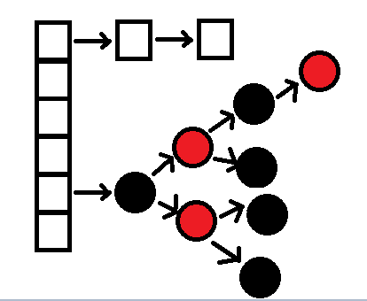
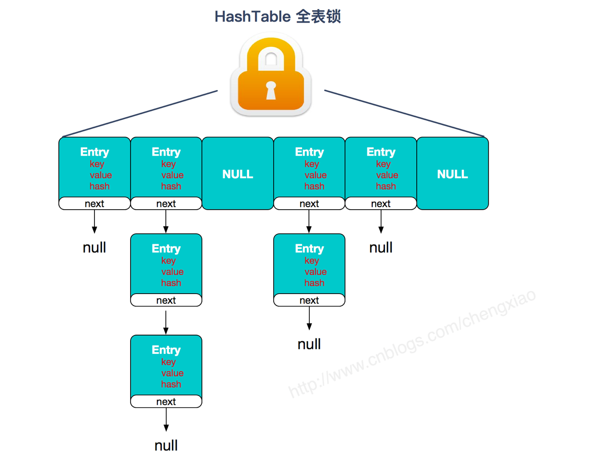
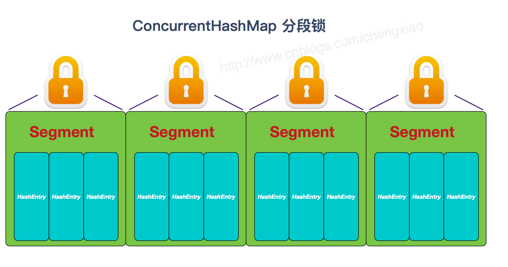

# HashMap

## 底层实现和原理
**1.7版本的HashMap**：
1. 数据结构：数组+链表。 数组是主体，链表是为了解决哈希冲突。
2. 默认大小：16
3. 达到总容量的0.75，数组扩容。
4. 存储元素，首先计算 key 的 hashcode，计算数组的索引值/元素存放的位置，对应索引没有元素直接添加，有元素equals比较内容如果相等就覆盖 不相等后加的放在前面。
5. 效率低


**1.8之后的HashMap**： 
1. 数据结构：数组+链表+红黑树。  
2. 链表长度/碰撞元素 大于阈值（默认为8），引入红黑树。 减少搜索时间。
3. 末尾插入。
4. 效率高




## 常用方法
#### put(K,V)
```text
public V put(K key, V value) {  
        return putVal(hash(key), key, value, false, true);  
    }  
  
  //插入值， onlyIfAbsent，为真的话，就是不替换，无就插，有就不插    methods evict，表示需要调整二叉树结构 在LinkedHashMap使用
final V putVal(int hash, K key, V value, boolean onlyIfAbsent, boolean evict) {  
        Node<K,V>[] tab; Node<K,V> p; int n, i;  
        if ((tab = table) == null || (n = tab.length) == 0)     //1 首先判断table数组的长度是否为0或table数组是否为空，即通常情况下表示刚创建一个空的HashMap时，当你调用put（K，V）方法时才会分配内存，即tab = resize()
            n = (tab = resize()).length;  
        if ((p = tab[i = (n - 1) & hash]) == null)        //2首先判断tab[(n - 1) & hash]处是否为空,如果是代表该数组下标为[(n - 1) & hash]的位置无元素，可直接put  
            tab[i] = newNode(hash, key, value, null);              // 没有数据，就是放一个链表头节点
        else {  
            Node<K,V> e; K k;  
            if (p.hash == hash &&  ((k = p.key) == key || (key != null && key.equals(k))))    //哈希值和equals值均同 则用新值换旧值
                e = p;  
            else if (p instanceof TreeNode)                         //否则  判断是否需要红黑树结构
                e = ((TreeNode<K,V>)p).putTreeVal(this, tab, hash, key, value);  
            else {                                                  //否则 为链表结构
                for (int binCount = 0; ; ++binCount) {  
                    if ((e = p.next) == null) {  
                        p.next = newNode(hash, key, value, null);  
                        if (binCount >= TREEIFY_THRESHOLD - 1) // -1 for 1st  
                            treeifyBin(tab, hash);                  //把链表转为二叉树存储
                        break;  
                    }  
                    if (e.hash == hash && ((k = e.key) == key || (key != null && key.equals(k))))//如果Hash值相同，则调用equals方法来确定是否存在该元素，则执行break语句  
                        break;//跳出for循环，执行下面的if语句，更新value的值.
  
                    p = e;  
                }  
            }  
            if (e != null) { // existing mapping for key  // 替换操作，key一样，旧值换为新值
                V oldValue = e.value;  
                if (!onlyIfAbsent || oldValue == null)  
                    e.value = value;  
                afterNodeAccess(e);//  
                return oldValue;  
            }  
        }  
        ++modCount;  
        if (++size > threshold)  
            resize();  
        afterNodeInsertion(evict);   //LinkedHashMap使用
        return null;  
    }
```

#### V get(Object key) 

```text
public V get(Object key) {  
        Node<K,V> e;  
        return (e = getNode(hash(key), key)) == null ? null : e.value;   //null值返回
    }  
final Node<K,V> getNode(int hash, Object key) {  
    Node<K,V>[] tab; Node<K,V> first, e; int n; K k;  
    if ((tab = table) != null && (n = tab.length) > 0 && (first = tab[(n - 1) & hash]) != null) {   //通过该hash值与table的长度n-1相与得到数组的索引first  
        if (first.hash == hash && ((k = first.key) == key || (key != null && key.equals(k))))  
            return first;            // always check first node
        if ((e = first.next) != null) {  
            if (first instanceof TreeNode)        //代表该HashMap为数组+红黑树结构  
                return ((TreeNode<K,V>)first).getTreeNode(hash, key);  
            do {                                //否则代表是数组+链表结构  
                if (e.hash == hash && ((k = e.key) == key || (key != null && key.equals(k))))  
                return e;  
            } while ((e = e.next) != null);  
        }
    }  
    return null;  
}
```

## 总结：
1. HashMap内部是基于Hash表实现的，该Hash表为Node类型数组+链表/红黑树，其中链表与红黑树是用来解决冲突的，即当往HashMap中put某个元素时，相同的hash值的两个值会被放到数组中的同一个位置上形成链表或红黑树。
2. HashMap存在扩容机制，是通过resize()方法实现的，即当HashMap中的元素个数超过数组大小*loadFactor时，就会进行数组扩容，loadFactor的默认值为0.75，数组的大小*loadFactor=threshold（即扩容的临界值），默认情况下，数组大小为16，那么当HashMap中元素个数超过16*0.75=12的时候，就把数组的大小扩展为 2*16=32，即扩大一倍
3. 另外从put与get的源码可以看到HashMap的Key与Value都允许为null，同时可以看到HashMap中的put与get方法均无synchronized关键字修饰，即HashMap不是线程安全的。
4. HashMap中的元素是唯一的（即同一个key只存在唯一的V与之对应），因为在put的过程中如果可能出现相同元素（K相同V不同），则原来的V将会被替换。

## 扩展
- **HashMap能不能排序**
  
  ```text
  HashMap无序。
  如果要对HashMap进行排序，可以借助List集合。keySet()/entrySet()
  ```
  
- **HashMap的长度为什么是2的幂次方**
  
  ```text
  为了提升性能。
  当 array.length长度是2的次幂时，key.hashcode % array.length等于key.hashcode & (array.length - 1)
  
  好处： 
  1. 能利用 与运算& 操作代替 取模运算% 操作，提升性能
  2. 数组扩容时，仅仅关注 “特殊位” 就可以重新定位元素
  ```

- **如何选择合适的Map**
    - HashMap可实现快速存储和检索，但其缺点是其包含的元素是无序的，这导致它在存在大量迭代的情况下表现不佳。
    - LinkedHashMap保留了HashMap的优势，且其包含的元素是有序的。它在有大量迭代的情况下表现更好。
    - TreeMap能便捷的实现对其内部元素的各种排序，但其一般性能比前两种map差。
    - LinkedHashMap映射减少了HashMap排序中的混乱，且不会导致TreeMap的性能损失。

- **HashMap 和 HashSet区别**
  
  HashSet 底层就是基于 HashMap 实现的。（HashSet 的源码非常非常少，因为除了 clone() 、writeObject()、readObject()是 HashSet 自己不得不实现之外，其他方法都是直接调用 HashMap 中的方法。
  
  HashMap | HashSet
  --- | --- 
  实现了Map接口 | 实现Set接口
  存储键值对 | 仅存储对象
  调用 put（）向map中添加元素 | 调用 add（）方法向Set中添加元素
  HashMap使用键（Key）计算Hashcode | HashSet使用成员对象来计算hashcode值，<br>对于两个对象来说hashcode可能相同，<br>所以equals()方法用来判断对象的相等性，

- **ConcurrentHashMap 和 HashTable的区别**

    ConcurrentHashMap 和 Hashtable 的区别主要体现在实现线程安全的方式上不同。
  
    - 【底层数据结构】
        - JDK1.7的 ConcurrentHashMap 底层采用 分段的数组+链表 实现
        - JDK1.8 采用的数据结构跟HashMap1.8的结构一样，数组+链表/红黑二叉树。
        - HashTable 和 JDK1.8 之前的 HashMap 的底层数据结构类似都是采用 数组+链表 的形式，数组是主体，链表则是主要为了解决哈希冲突而存在的；
    - 【实现线程安全的方式】
        - 在JDK1.7的时候，ConcurrentHashMap（分段锁） 对整个桶数组进行了分割分段(Segment)，每一把锁只锁容器其中一部分数据，多线程访问容器里不同数据段的数据，就不会存在锁竞争，提高并发访问率。 
        - JDK1.8 的时候已经摒弃了Segment的概念，而是直接用 Node 数组+链表+红黑树的数据结构来实现，并发控制使用 synchronized 和 CAS 来操作。（JDK1.6以后 对 synchronized锁做了很多优化） 整个看起来就像是优化过且线程安全的 HashMap，虽然在JDK1.8中还能看到 Segment 的数据结构，但是已经简化了属性，只是为了兼容旧版本。
        - Hashable(同一把锁) :使用 synchronized 来保证线程安全，效率非常低下。当一个线程访问同步方法时，其他线程也访问同步方法，可能会进入阻塞或轮询状态，如使用 put 添加元素，另一个线程不能使用 put 添加元素，也不能使用 get，竞争会越来越激烈效率越低。
  
- **ConcurrentHashMap线程安全的具体实现方式/底层具体实现**
    - JDK1.7 
        - 首先将数据分为一段一段的存储，然后给每一段数据配一把锁，当一个线程占用锁访问其中一个段数据时，其他段的数据也能被其他线程访问。ConcurrentHashMap 是由 Segment 数组结构和 HashEntry 数组结构组成。Segment 实现了 ReentrantLock,所以 Segment 是一种可重入锁，扮演锁的角色。HashEntry 用于存储键值对数据。static class Segment<K,V> extends ReentrantLock implements Serializable {} 一个 ConcurrentHashMap 里包含一个 Segment 数组。Segment 的结构和HashMap类似，是一种数组和链表结构，一个 Segment 包含一个 HashEntry 数组，每个 HashEntry 是一个链表结构的元素，每个 Segment 守护着一个HashEntry数组里的元素，当对 HashEntry 数组的数据进行修改时，必须首先获得对应的 Segment的锁。
    - JDK1.8
        - ConcurrentHashMap取消了Segment分段锁，采用CAS和synchronized来保证并发安全。数据结构跟HashMap1.8的结构类似，数组+链表/红黑二叉树。Java 8在链表长度超过一定阈值（8）时将链表（寻址时间复杂度为O(N)）转换为红黑树（寻址时间复杂度为O(long(N))） synchronized只锁定当前链表或红黑二叉树的首节点，这样只要hash不冲突，就不会产生并发，效率又提升N倍。

HashTable 



JDK1.7的ConcurrentHashMap



JDK1.8的ConcurrentHashMap（TreeBin: 红黑二叉树节点 Node: 链表节点）


   
- **HashMap 和 Hashtable 的区别**
    - 【线程是否安全】
        - HashMap 是非线程安全的。
        - HashTable 是线程安全的。HashTable 内部的方法基本都经过synchronized 修饰。
        - （如果你要保证线程安全的话就使用 ConcurrentHashMap ）。
    - 【效率】
        - 因为线程安全的问题，HashMap 要比 HashTable 效率高一点。
        - HashTable 基本被淘汰，不要在代码中使用它。
    - 【对Null key 和Null value的支持】
        - HashMap 中，null 可以作为键，这样的键只有一个，可以有一个或多个键所对应的值为 null。
        - HashTable 中 put 进的键值只要有一个 null，直接抛出 NullPointerException。
    - 【初始容量大小和每次扩充容量大小的不同】 
        - 创建时如果不指定容量初始值，Hashtable 默认的初始大小为11，之后每次扩充，容量变为原来的2n+1。HashMap 默认的初始化大小为16。之后每次扩充，容量变为原来的2倍。
        - 创建时如果给定了容量初始值，那么 Hashtable 会直接使用你给定的大小，而 HashMap 会将其扩充为2的幂次方大小。
        - 底层数据结构： JDK1.8 以后的 HashMap 在解决哈希冲突时有了较大的变化，当链表长度大于阈值（默认为8）时，将链表转化为红黑树，以减少搜索时间。Hashtable 没有这样的机制。  