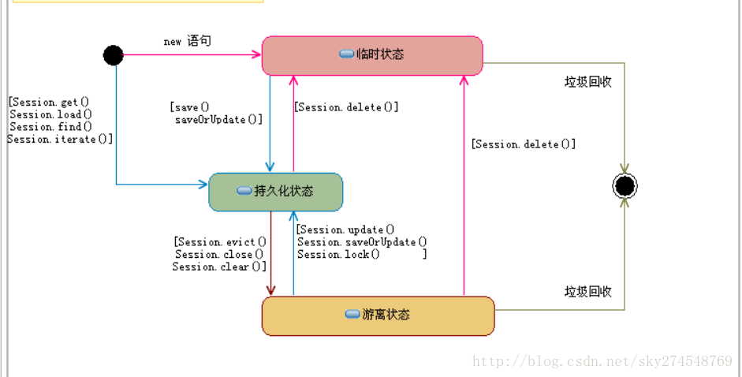

# Hibernate 

> 开放源代码的对象关系映射框架。
  对JDBC进行了非常轻量级的对象封装。
  将POJO与数据库表建立映射关系。
  全自动的orm框架，自动生成SQL语句，自动执行。

## 为什么要用Hibernate/JDBC的缺点
- 编程过程很繁琐，使用try和catch比较多
- jdbc没有做数据的缓存
- 没有做到面向对象编程，
- SQL语句的跨平台性很差。

## JDBC的优点：效率高

## Hibernate优点
- 完全面向对象编程
- hibernate缓存，一级缓存 二级缓存 查询缓存
- 编程的时候比较简单
- 跨平台性很强
- 使用场合是企业内部的系统。

## Hibernate缺点
- 效率较低
- 表中的数据如果在千万级别，不适合
- 如果表与表之间关系比较复杂，不适合

## Hibernate 的API接口
Hibernate的API一共有6个。
分别是 Session，SessionFactory，Transaction，Query，Criteria 和 Configuration。通过这些接口，可以对持久化对象进行存取、事务控制。

- Configuration：负责配置并启动hibernate，创建SessionFactory　　
- SessionFactory：负责初始化hibernate，创建session对象
    - 1、hibernate中的配置文件、映射文件、持久化类的信息都在sessionFactory中
    - 2、sessionFactory中存放的信息都是共享的信息
    - 3、sessionFactory本身就是线程安全的
    - 4、一个hibernate框架sessionFactory只有一个
    - 5、sessionFactory是一个重量级别的类
- Session：负责被持久化对象CRUD操作
    - 1、得到了一个session，相当于打开了一次数据库的连接
    - 2、在hibernate中，对数据的crud操作都是由session来完成的
- Transaction：负责事物相关的操作
    - hibernate中的事务默认不是自动提交的
    - 设置了connection的setAutoCommit为false
    - 只有产生了连接，才能进行事务的操作。所以只有有了session以后，才能有transaction
- Query：负责执行各种数据库查询

## Hibernate 的运行原理
hibernate里面提供了3个核心接口：Configuration、SessionFactory、Session。
1. hibernate启动的时候利用Configuration读取xml配置文件
2. 通过配置文件创建SessionFactory对象，初始化hibernate基本信息
3. 获取session然后调用CRUD方法进行数据操作，hibernate会把我们的数据进行三种状态的划分，然后根据状态进行管理我们的数据，对应的发送SQL进行数据操作
4. 关闭session，如果有事务的情况下，需要手动获取事务并开启，然后事务结束后提交事务。
5. 在提交事务的时候，去验证我们的快照里面的数据和缓存数据是否一致，如果不一致，发送SQL进行修改。

## Hibernate 数据的三种状态
Hibernate把管理的数据分为三种状态： 

- 瞬时状态/临时状态

    刚new出来的数据–内存有，数据库没有

- 持久状态

    从数据查询的，或者刚保存到数据库，session没关闭的， 数据库有，内存也有

- 游离状态

    数据库有，内存没有

实际上hibernate对数据划分三种状态，主要是为了管理我们持久的数据，在事务提交的时候，hibernate去对比处于持久状态的数据是否发生改变，(快照区、一级缓存区)，当我们会话结束前，对持久状态数据进行了修改的话，快照区的数据会跟着改变。当session提交事务的时候，如果发现快照区和一级缓存的数据不一致，就会发送SQL进行修改。

## Hibernate 的缓存机制
             
hibernate分为2级缓存

一级缓存又叫session缓存，又叫事务级缓存，生命周期从事务开始到事务结束，一级缓存是hibernate自带的，暴力使用，当我们一创建session就已有这个缓存了。数据库就会自动往缓存存放，

二级缓存是hibernate提供的一组开放的接口方式实现的，都是通过整合第三方的缓存框架来实现的，二级缓存又叫sessionFactory的缓存，可以跨session访问。常用的EHcache、OScache，这个需要一些配置。

当我们每次 查询数据的时候，首先是到一级缓存查看是否存在该对象，如果有直接返回，如果没有就去二级缓存进行查看，如果有直接返回，如果没有在发送SQL到数据库查询数据，

当SQL查询回该数据的时候，hibernate会把该对象以主键为标记的形式存储到二级缓存和一级缓存，如果返回的是集合，会把集合打散然后以主键的形式存储到缓存。一级缓存和二级缓存只针对以ID查询的方式生效，get、load方法。

## Hibernate的乐观锁和悲观锁

Hibernate在管理数据的时候，由于并发，可能会存在很多问题： 
1. 数据丢失更新
2. 读到脏数据
3. 数据虚度或幻读。
4. 重复读取数据不一致。

以上问题在并发中都可能存在，所以Hiberante在处理线程并发的时候，需要进行线程同步，提供的机制是利用锁来完成。

#### 悲观锁

所谓的悲观锁，就是hibernate心态不好，认为每一次操作都会出现并发，所以当我们查询数据的时候就直接把这一条数据锁住，不让别人操作。底层是利用的数据库的锁机制for update来实现的，就是查询数据的时候利用数据库把当前查询的数据给锁住，不让其他线程操作。

悲观锁在hibernate查询数据的时候，利用LockOptions.UPGRADE来进行设置。

悲观锁是在查询的时候每一条数据都会被锁住，只有当是session关闭的时候，锁才会释放，这样效率非常的低下，所以一般不使用。

#### 乐观锁

乐观锁提供了两种机制来实现： 
1. version 版本号来验证
2. timestamp 时间戳来验证

## [to...JDBC](../JDBC/JDBC.md) 
