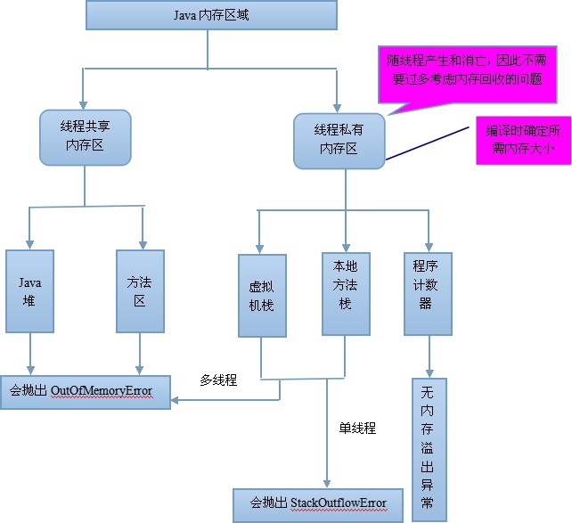
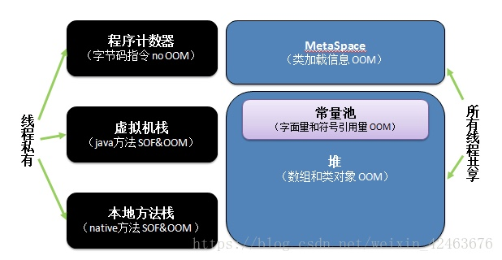

# Java 虚拟机
> Java Virtual Machine

## JVM内存模型

#### JDK1.7
1. 程序计数器
2. Java虚拟机栈
3. 本地方法栈
4. Java堆
5. 方法区

#### JDK1.8 修改
1. 永久区从堆中移除。
2. 元数据区（替换掉了方法区），存储在本地内存。

- 程序计数器（Program Counter Register）：是一块较小的内存空间，他可以看做是当前线程所执行的字节码的行号指示器。在虚拟机的概念模型里，字节码解释器工作时就是通过改变这个计数器的值来选取下一条需要执行的字节码指令，分支、循环、跳转、异常处理、线程恢复等基础功能都需要依赖计数器完成。
- 虚拟机栈（Java Virtual Machine Stacks）：描述的是java方法执行的内存模型：每个方法在执行的同时都会创建一个栈帧（Stack Frame），用于存储 局部变量、操作数栈、动态链接、方法出口等信息。每一个方法从调用到执行完成的过程，就对应着一个栈帧在虚拟机栈中入栈到出栈的过程。虚拟机栈也是线程私有的，生命周期于线程相同。
- 本地方法栈（Method Native Stack）：与虚拟机栈的作用非常相似，区别是虚拟机栈为虚拟机执行java方法服务，而本地方法栈则为虚拟机使用到的Native方法服务。
- 堆（Java Heap）：此内存区域的唯一作用就是用来存放对象实例，几乎所有的对象实例都在这里分配内存。堆是java虚拟机管理的内存中最大的一块，被所有线程共享。由于堆是垃圾收集器管理的主要区域，所以也被称为GC堆。由于现代收集器基本都采用分代收集算法，所以java堆中还可以细分为新生代，老年代。新生代又细分为Edan区、From Survivor区(S0)、To Survivor区（S1）。
- 元空间（Metaspace）：存储已被虚拟机加载的类信息。随着JDK8的到来，JVM不再有方法区（PermGen），原方法区存储的信息被分成两部分：1、虚拟机加载的类信息，2、运行时常量池。分别被移动到了元空间和堆中。

## Java虚拟机的基本结构
1. 方法区 ： 类型的常量池、字段、方法信息、方法字节码。通常和永久区关联在一起。
2. Java堆 heap： 应用系统对象。所有线程共享，GC主要工作区间，新生代和老生代。
3. Java栈 stack： 帧栈。帧保存一个方法的局部变量，操作数栈，常量池指针。线程私有。

## 内存溢出的原因 Java.lang.outofmemory
1. JVM 内存过小。启动参数内存值设定的过小。
2. 程序不严密。死循环或循环产生过多重复的对象。
3. 产生了过多的垃圾。
4. 内存中加载的数据量过于庞大，如一次从数据库取出过多数据；
5. 集合类中有对对象的引用，使用完后未清空，使得JVM不能回收；
6. 使用的第三方软件中的BUG；

## Java程序初始化的顺序/原则
1. 静态对象（变量）优先于非静态对象（变量）初始化，其中，静态对象（变量）只初始化一次，而非静态对象（变量）可能会初始化多次。
2. 父类优先于子类进行初始化。
3. 按照成员变量的定义顺序进行初始化。即使变量定义散步于方法定义中，它们依然在任何方法（包括构造函数）被调用之前先初始化。

Java程序初始化工作可以在许多不同的代码库中来完成，执行顺序：

父类静态变量 --> 父类静态代码块 --> 子类静态变量 --> 子类静态代码块 --> 父类非静态变量 --> 父类非静态代码块 --> 父类构造函数 --> 子类非静态变量 --> 子类非静态代码块 --> 子类构造函数。

## JVM的内存结构和管理机制

## Java的类加载机制。类加载的主要步骤
1. 装载。根据查找路径找到相对应的class文件，然后导入。
2. 链接。检查 待加载的class文件的正确性，准备 给类中的静态变量分配存储空间，解析 将符号引用转换成直接引用。
3. 初始化。对静态变量和静态代码块执行初始化工作。

## JVM调优
## JVM原理

