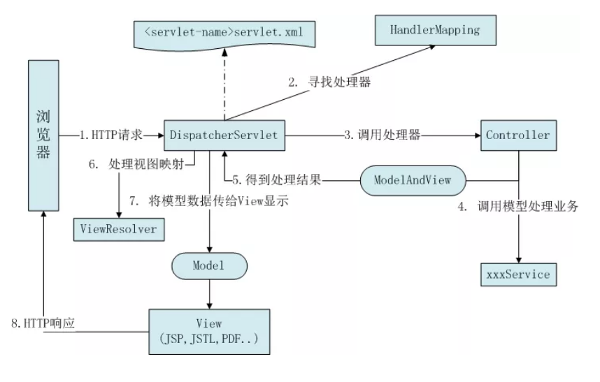
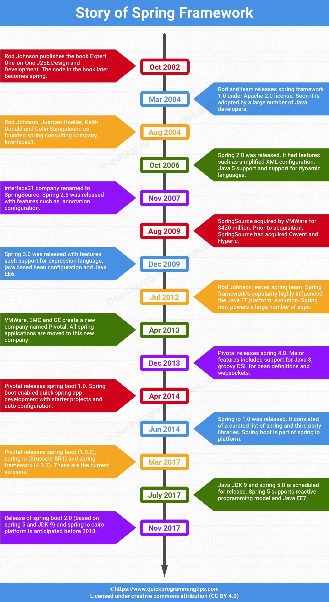

# Spring
> Spring 是一个开源框架，是为了解决企业应用程序开发复杂性而创建的。框架的主要优势之一就是其分层架构，分层架构允许您选择使用哪一个组件，同时为 J2EE 应用程序开发提供集成的框架。

## Spring  

## [Spring 架构底层模型](Spring-Framework.md)

## Spring 架构特征
> 轻量级的 [控制反转IoC](Spring-IoC.md) 和 [面向切面AOP](Spring-AOP.md) 的容器框架。
- **轻量**： 从大小和开销两方面而言，Spring都是轻量的。 1MB
- **控制反转**： Spring通过一种控制反转IOC技术促进了松耦合。当应用了IOC 一个对象依赖的其他对象会通过被动的方式传递进来，而不是这个对象自己创建或者查找依赖对象。
- **面向切面**： Spring提供了面向切面编程的丰富支持，允许通过分离应用的业务逻辑与系统级服务进行内聚性的开发。
- **容器**： Spring 包含并管理应用对象的配置和生命周期。


#### [Spring 详细介绍](Spring-Spring.md)


## SpringMVC 
分离了控制器，模型对象，分派器以及处理程序对象的角色。

Spring MVC基于Spring框架、Servlet和JSP（JavaServer Page）

#### Spring MVC原理



## [Spring Boot](Spring-Boot.md)
简单易用，轻松上手，其中注解会给使用者提供方便。

对第三方技术进行了很好的封装和整合，提供了大量第三方接口。

可以通过依赖自动配置，不需要XML等配置文件。

提供了安全等特性

简化了基于Spring的应用开发，通过少量的代码就能创建一个独立的 产品基本的Spring应用。
为Spring平台及第三方库提供开箱即用的设置。

设计目的，简化Spring应用的初始化搭建以及开发过程。
默认大于配置。

Spring最初利用“工厂模式” 和代理模式解耦应用组件。大家觉得挺好用，于是按照这种模式搞了一个MVC框架，用来开发web应用（SpringMVC）。然后发现每次开发都要搞很多依赖，写很多样板代码很麻烦，于是搞了一些懒人整合包starter，这就是Spring Boot。

## [Spring Cloud](https://github.com/jiaxiaojiao/SpringCloud-study-guide)
> Spring Cloud是一系列框架的有序集合。

> Spring Cloud并没有重复制造轮子，它只是将目前各家公司开发的比较成熟、经得起实际考验的服务框架组合起来，通过Spring Boot风格进行再封装屏蔽掉了复杂的配置和实现原理，最终给开发者留出了一套简单易懂、易部署和易维护的分布式系统开发工具包。

云端分布式架构解决方案，基于Spring Boot。

Spring MVC => Spring => Spring Boot  => Spring Cloud

## Spring 的历史
[Spring 框架的历史](https://www.quickprogrammingtips.com/spring-boot/history-of-spring-framework-and-spring-boot.html)

 
 

## Spring 5概述
## Spring 5 Framework体系结构
## Spring5 环境搭建

IOC
- 容器基本实现和组成
- 装配Bean的方式： xml ，注解，JavaConfig
- BeanFactory源码分析
- BeanDefinition源码分析
- Bean生命周期
- 依赖实现

AOP
- 面向切面的基础：动态代理，Spring对AOP的支持（注解，xml）
- AOP源码分析：ProxyFactory源码解析，AOPProxy源码解析（JDKDynamicAOPProxy，Cglib2AOPProxy），拦截与织入（advice源码分析，Interceptor源码分析）
- Transaction事务分析：事务的基础，Spring对事务的支持，源码分析
- Spring Cache框架源码分析


#### spring里面有哪些你熟悉的设计模式，你怎么理解和应用的

- Spring的发展背景简介
- Spring IOC/DI 深入剖析
- Spring IOC容器设计原理及高级特性
- Spring AOP设计原理及实践
- Spring JDBC设计原理及手写实现
- Spring MVC架构设计原理及手写实现
- Struts2与Spring MVC的比较 

## 其他
```text

事务管理。

执行某操作，前50次成功，第51次失败。
a: 全部回滚
b: 前50次提交，第51次抛出异常。
ab场景分别如何设置Spring。（传播性）


spring MVC和Struts2的区别

spring是单例，如果实现多例，怎么实现。

Spring MVC的流程。一个request请求历经了哪些。
最好能画出 springmvc的流程图

Spring注解

spring事务管理机制

spring底层原理

Spring Boot

spring
```