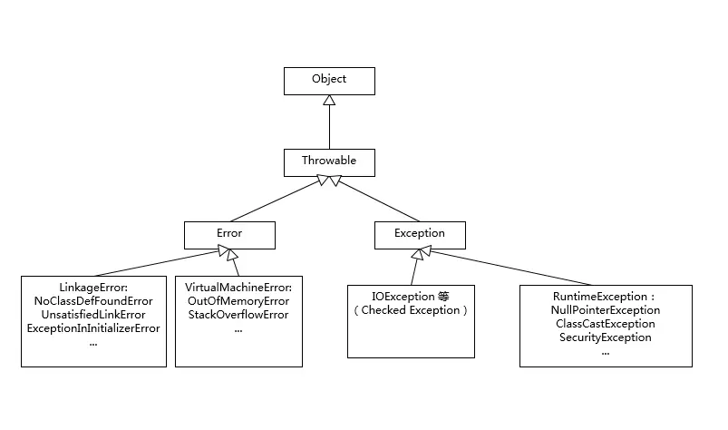

# 异常 Throwable


## 对比 Exception 、Error 。运行时异常 和 一般异常 的区别？
```text
// Exception 继承了 Throwable
public class Exception extends Throwable

// Error 继承了 Throwable
public class Error extends Throwable 

// Throwalbe 实现了 Serializable 接口
public class Throwable implements Serializable 

```

1. Exception和Error 都继承了 Throwable 类，在Java 中只有 Throwable 类的实例才可以被抛出或者捕获 throw/catch ，它是异常处理机制的基本组成类型。
2. Exception 和 Error 体现了 Java  平台设计者对不同异常情况的分类。
3. Exception 是程序正常运行时，可以预料的意外情况，可能并且应该被捕获 进行相应的处理。
4. Error 是指在正常情况下，不大可能出现的情况，绝大部门的Error 都会导致程序（比如JVM本身）处于非正常的、不可恢复的状态。比如，OutOfMemoryError 

## Exception 
Exception 分为 可检查异常 checked  和 不检查异常 unchecked，可检查异常在源代码里必须显式进行捕获处理。不检查异常就是所谓的运行时异常 NullPointerException

#### RuntimeException 运行时异常
> RuntimeException 是Java中所有运行时异常的父类。

几种常见的运行时异常：
- NullPointerException - 空指针引用异常
```text
// 访问空对象成员
String s=null;
int size=s.size();
```
- ClassCastException - 类型强制转换异常。
- ClassNotFoundException - 不能加载所需要的类
- IllegalArgumentException - 传递非法参数异常。
- NumberFormatException - 数字格式异常
```text
// IllegalArgumentException 继承了 RuntimeException
public class IllegalArgumentException extends RuntimeException 

// 数字格式异常 NumberFormatException 继承了 传递非法参数异常IllegalArgumentException
public class NumberFormatException extends IllegalArgumentException 
```
- ArithmeticException - 算术运算异常
```text
// 算术错误，例如：一个整数“除以零”时
int a=5/0;
```
- ArrayStoreException - 向数组中存放与声明类型不兼容对象异常
- IndexOutOfBoundsException - 下标越界异常
- NegativeArraySizeException - 创建一个大小为负数的数组错误异常
- SecurityException - 安全异常
- UnsupportedOperationException - 不支持的操作异常

## 异常捕获
使用try catch捕获异常。
- 使用Finally代码块 清理资源，或者使用Java 7 的 Try-With-Resource 语法
    - finally代码块， 总是会执行。
- 优先明确的异常。
    - 尝试寻找最适合你的异常事件类，例如，抛出一个 NumberFormatException 来替换一个 IllegalArgumentException 。避免抛出一个不明确的异常。
- 优先捕获最具体的异常，将不太具体的catch块添加到列表的末尾。
- 记录制定的异常。尽可能多地向调用者提供信息，以便避免或处理异常
    - 向 Javadoc 添加 @throws 声明并描述可能导致异常的情况
- 使用描述性消息抛出异常
- 不要捕获Throwable类。
- 不要忽略异常，catch中不能什么操作都不做。

## 其他
```text
http://www.importnew.com/27964.html
https://blog.csdn.net/jakezhang1990/article/details/72880700
https://www.cnblogs.com/knightsu/p/7114914.html
https://www.cnblogs.com/dolphin0520/p/3769804.html
https://blog.csdn.net/yongyuai/article/details/79752608
```