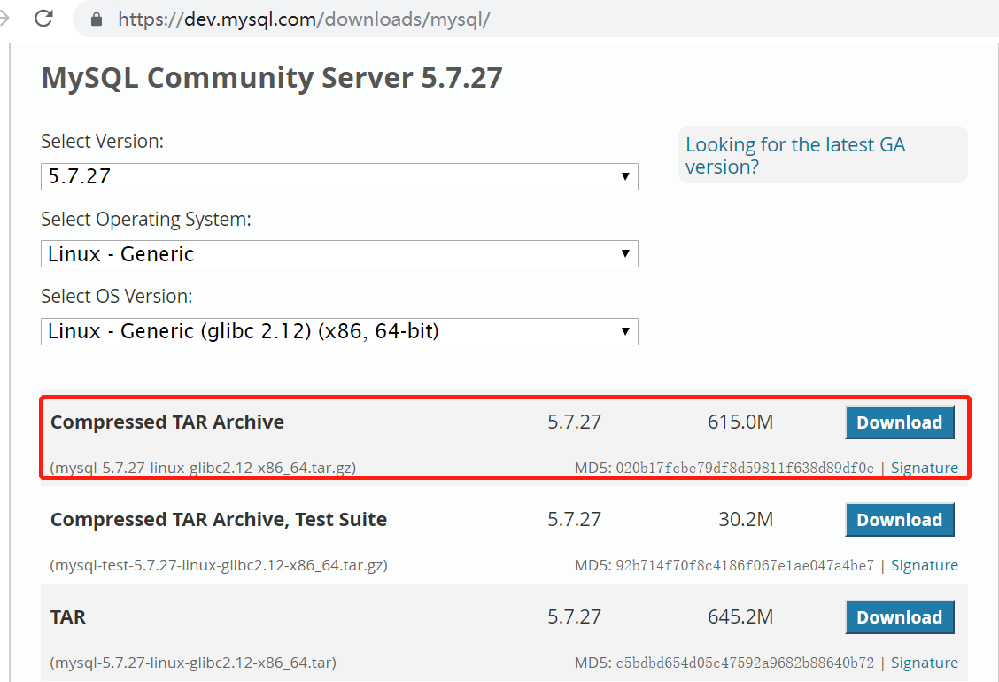

## Linux 离线安装MySQL

> 服务器环境 CentOS7 x64
> 
> 安装MySQL 5.7

### 目录
- [下载离线安装包](#下载)
- [检查系统是否预装mariadb， 如果存在就卸载](#卸载CentOS7系统自带mariadb)
    - [为什么要卸载mariadb](#为什么要卸载mariadb)
- [检查是否安装MySQL](#检查是否安装MySQL)
- [检查用户和组是否存在，如果不存在就添加](#检查用户和组是否存在)
- [上传离线安装包到服务器](#上传服务器)
- [更改mysql所属的组和用户](#更改mysql所属的组和用户)
- [修改/etc/my.cnf](#修改my.cnf)
- [安装MySQL](#安装MySQL)
- [启动MySQL](#启动MySQL)
- [设置开机启动](#设置开机启动)
- [修改配置文件](#修改配置文件)
- [修改MySQL的初始密码](#修改MySQL的初始密码)
- [重启mysql生效](#重启mysql生效)

- [另一个安装MySQL操作日志](Linux-MySQL-install-off-line2.md)
- [参考](https://www.cnblogs.com/yy3b2007com/p/10497787.html)

### 下载

最新版本地址： [https://dev.mysql.com/downloads/mysql/](https://dev.mysql.com/downloads/mysql/)

MySQL8.0版本下载地址：[https://dev.mysql.com/downloads/mysql/8.0.html](https://dev.mysql.com/downloads/mysql/8.0.html)

MySQL5.7版本下载地址：[https://dev.mysql.com/downloads/mysql/5.7.html](https://dev.mysql.com/downloads/mysql/5.7.html)

已存档版本下载地址：[https://downloads.mysql.com/archives/community/](https://downloads.mysql.com/archives/community/)


本次安装是从【MySQL5.7版本下载地址】中下载的：

1. Select Version: 5.7.27

2. Select Operating System: Linux - Generic 

3. Select OS Version:Linux - Generic(glibc 2.12)(x86,64-bit)

4. Compressed TAR Archive 5.7.27	615.0M

    (mysql-5.7.27-linux-glibc2.12-x86_64.tar.gz)	MD5: 020b17fcbe79df8d59811f638d89df0e



### 为什么要卸载mariadb

系统预置的mariadb会和安装MySQL的文件冲突，所以需要先卸载。

### 卸载CentOS7系统自带mariadb

```text
# 查看系统自带的Mariadb
[root@CDH-141 ~]# rpm -qa|grep mariadb
mariadb-libs-5.5.44-2.el7.centos.x86_64
# 卸载系统自带的Mariadb
[root@CDH-141 ~]# rpm -e --nodeps mariadb-libs-5.5.44-2.el7.centos.x86_64
# 删除etc目录下的my.cnf
[root@CDH-141 ~]# rm /etc/my.cnf
```


```text
# 查看系统自带的Mariadb
[root@YZ-222-114-169 ~]# rpm -qa|grep mariadb
# 没有
# 删除etc目录下的my.cnf
# 没有
```

### 检查是否安装MySQL

```text
# 检查mysql是否存在
[root@YZ-222-114-169 etc]# rpm -qa | grep mysql
```

### 检查用户和组是否存在

```text
[root@YZ-222-114-169 etc]# cat /etc/group | grep mysql
mysql:x:521:
[root@YZ-222-114-169 etc]# cat /etc/passwd | grep mysql
mysql:x:499:521:MySQL server:/var/lib/mysql:/bin/bash
[root@YZ-222-114-169 etc]# 
```

查询全部用户（只是做记录，没必要执行）

```text
[root@YZ-222-114-169 etc]# cat /etc/passwd|grep -v nologin|grep -v halt|grep -v shutdown|awk -F ":" '{print $1 "|" $3 "1" $4}' | more
root|010
sync|510
sa|50011000
pe|51011001
supdev|51111002
dev|51211003
netops|51311004
monitor|51511006
logviewer|51611007
build1.bds|80011008
xdba|52011009
mdba|52111010
oracle|5221522
admin|60011011
tomcat|100011012
mysql|4991521
[root@YZ-222-114-169 etc]# 

```


### 上传服务器

上传离线安装包 `mysql-5.7.27-linux-glibc2.12-x86_64.tar.gz` 到目录 `/usr/local`

```text
# 进入/usr/local/文件夹
[root@YZ-222-114-169 ~]# cd /usr/local/

# 上传mysql TAR包
[root@YZ-222-114-169 local]# rz
[root@YZ-222-114-169 local]# ls
bin  games    info  lib64    man    mysql-5.7.27-linux-glibc2.12-x86_64.tar.gz  share
etc  include  lib   libexec  sbin   src

# 解压mysql-5.7.27-linux-glibc2.12-x86_64.tar.gz
[root@YZ-222-114-169 local]# tar -zxvf mysql-5.7.27-linux-glibc2.12-x86_64.tar.gz 
mysql-5.7.27-linux-glibc2.12-x86_64/bin/myisam_ftdump
mysql-5.7.27-linux-glibc2.12-x86_64/bin/myisamchk
mysql-5.7.27-linux-glibc2.12-x86_64/bin/myisamlog
mysql-5.7.27-linux-glibc2.12-x86_64/bin/myisampack
mysql-5.7.27-linux-glibc2.12-x86_64/bin/mysql
......
mysql-5.7.27-linux-glibc2.12-x86_64/support-files/magic
mysql-5.7.27-linux-glibc2.12-x86_64/support-files/mysql.server
mysql-5.7.27-linux-glibc2.12-x86_64/docs/INFO_BIN
mysql-5.7.27-linux-glibc2.12-x86_64/docs/INFO_SRC
[root@YZ-222-114-169 local]# ls
bin  games    info  lib64    man    mysql-5.7.27-linux-glibc2.12-x86_64  sbin   src
etc  include  lib   libexec  mysql-5.7.27-linux-glibc2.12-x86_64.tar.gz  share

# 修改文件夹mysql-5.7.27-linux-glibc2.12-x86_64为mysql
[root@YZ-222-114-169 local]# mv mysql-5.7.27-linux-glibc2.12-x86_64 mysql
[root@YZ-222-114-169 local]# ls
bin  games    info  lib64    man   sbin   src
etc  include  lib   libexec  mysql  mysql-5.7.27-linux-glibc2.12-x86_64.tar.gz  share

```

### 更改mysql所属的组和用户

```text
# 更改所属的组和用户
[root@YZ-222-114-169 local]# chown -R mysql mysql/
[root@YZ-222-114-169 local]# chgrp -R mysql mysql/
[root@YZ-222-114-169 local]# cd mysql/

# mysql中，创建data文件夹
[root@YZ-222-114-169 mysql]# mkdir data
[root@YZ-222-114-169 mysql]# chown -R mysql:mysql data
[root@YZ-222-114-169 mysql]# ls
bin  COPYING  data  docs  include  lib  man  README  share  support-files
```

### 修改my.cnf

```text
# 进入/etc文件夹下
[root@YZ-222-114-169 mysql]# cd /etc/
[root@YZ-222-114-169 etc]# find my.cnf
find: ‘my.cnf’: No such file or directory

# 编辑my.cnf
[root@YZ-222-114-169 etc]# vi my.cnf
```

my.cnf 内容如下：
```text
[mysql]
socket=/var/lib/mysql/mysql.sock
# set mysql client default chararter
default-character-set=utf8

[mysqld]
socket=/var/lib/mysql/mysql.sock
# set mysql server port  
port = 3306 #默认是3306
# set mysql install base dir
basedir=/usr/local/mysql
# set the data store dir
datadir=/usr/local/mysql/data
# set the number of allow max connnection
max_connections=200
# set server charactre default encoding
character-set-server=utf8
# the storage engine
default-storage-engine=INNODB
lower_case_table_names=1
max_allowed_packet=16M
explicit_defaults_for_timestamp=true

[mysql.server]
user=mysql
basedir=/usr/local/mysql
```


### 安装MySQL

```text
# 进入mysql
[root@YZ-222-114-169 etc]# cd /usr/local/mysql/

# 安装mysql
[root@YZ-222-114-169 mysql]# bin/mysql_install_db --user=mysql --basedir=/usr/local/mysql/ --datadir=/usr/local/mysql/data/
2019-10-12 10:33:00 [WARNING] mysql_install_db is deprecated. Please consider switching to mysqld --initialize
2019-10-12 10:33:03 [WARNING] The bootstrap log isn't empty:
2019-10-12 10:33:03 [WARNING] 2019-10-12T02:33:00.778646Z 0 [Warning] --bootstrap is deprecated. Please consider using --initialize instead

```

设置文件及目录权限：

```text
[root@YZ-222-114-169 mysql]# cp ./support-files/mysql.server /etc/init.d/mysqld
[root@YZ-222-114-169 mysql]# chmod +x /etc/init.d/mysqld
```


### 启动MySQL

```text
# 启动mysql
[root@YZ-222-114-169 mysql]# /etc/init.d/mysqld restart
 ERROR! MySQL server PID file could not be found!
Starting MySQL.Logging to '/usr/local/mysql/data/YZ-222-114-169.h.chinabank.com.cn.err'.
 SUCCESS! 
[root@YZ-222-114-169 mysql]# /etc/init.d/mysqld restart
Shutting down MySQL.. SUCCESS! 
Starting MySQL. SUCCESS! 

# 重启也可以使用命令service mysqld restart
[root@YZ-222-114-169 mysql]# service mysqld restart
Shutting down MySQL.. SUCCESS! 
Starting MySQL. SUCCESS! 
```

### 设置开机启动

```text
#设置开机启动
[root@YZ-222-114-169 mysql]# chkconfig --level 35 mysqld on
[root@YZ-222-114-169 mysql]# chkconfig --list mysqld

Note: This output shows SysV services only and does not include native
      systemd services. SysV configuration data might be overridden by native
      systemd configuration.

      If you want to list systemd services use 'systemctl list-unit-files'.
      To see services enabled on particular target use
      'systemctl list-dependencies [target]'.

mysqld         	0:off	1:off	2:on	3:on	4:on	5:on	6:off
[root@YZ-222-114-169 mysql]# chmod +x /etc/rc.d/init.d/mysqld
[root@YZ-222-114-169 mysql]# chkconfig --add mysqld
[root@YZ-222-114-169 mysql]# chkconfig --list mysqld

Note: This output shows SysV services only and does not include native
      systemd services. SysV configuration data might be overridden by native
      systemd configuration.

      If you want to list systemd services use 'systemctl list-unit-files'.
      To see services enabled on particular target use
      'systemctl list-dependencies [target]'.

mysqld         	0:off	1:off	2:on	3:on	4:on	5:on	6:off
[root@YZ-222-114-169 mysql]# service mysqld status
 SUCCESS! MySQL running (20526)
[root@YZ-222-114-169 mysql]# 
```

### 修改配置文件

```text
# 进入/etc/profile文件夹
[root@YZ-222-114-169 ~]# cd /etc/
[root@YZ-222-114-169 etc]# vi profile

# 修改/etc/profile文件。

# 使文件生效
[root@YZ-222-114-169 etc]# source /etc/profile
```

修改/etc/profile，在最后添加如下内容：

```text
#set mysql environment
export PATH=$PATH:/usr/local/mysql/bin
```

### 修改MySQL的初始密码

1. 获取MySQL的初始密码

    ```text
    [root@YZ-222-114-169 etc]# cat /root/.mysql_secret
    # Password set for user 'root@localhost' at 2019-10-12 10:33:00 
    gtu--z4n<1aO
    [root@YZ-222-114-169 etc]# 
    ```

2. 修改密码
    
    ```text
    # 进入MySQL
    [root@YZ-222-114-169 etc]# mysql -u root -p
    Enter password: #此处填写上边获取到的初始密码 gtu--z4n<1aO
    Welcome to the MySQL monitor.  Commands end with ; or \g.
    Your MySQL connection id is 3
    Server version: 5.7.27
    
    Copyright (c) 2000, 2019, Oracle and/or its affiliates. All rights reserved.
    
    Oracle is a registered trademark of Oracle Corporation and/or its
    affiliates. Other names may be trademarks of their respective
    owners.
    
    Type 'help;' or '\h' for help. Type '\c' to clear the current input statement.
    
    # 修改初始密码为 RootPass!
    mysql> set password for 'root'@'localhost'=password('RootPass!');
    Query OK, 0 rows affected, 1 warning (0.00 sec)
    
    # 查看密码配置信息
    mysql> show variables like '%password%';
    +---------------------------------------+-------+
    | Variable_name                         | Value |
    +---------------------------------------+-------+
    | default_password_lifetime             | 0     |
    | disconnect_on_expired_password        | ON    |
    | log_builtin_as_identified_by_password | OFF   |
    | mysql_native_password_proxy_users     | OFF   |
    | old_passwords                         | 0     |
    | report_password                       |       |
    | sha256_password_proxy_users           | OFF   |
    +---------------------------------------+-------+
    7 rows in set (0.00 sec)
    
    # 添加远程登录用户 databus
    mysql> GRANT ALL PRIVILEGES ON *.* TO 'databus'@'%' IDENTIFIED BY 'DataBusPass!' WITH GRANT OPTION;
    Query OK, 0 rows affected, 1 warning (0.00 sec)
    
    # 新设置用户或更改密码后需用flush privileges刷新MySQL的系统权限相关表
    # 或 重启MySQL服务
    mysql> flush privileges;
    Query OK, 0 rows affected (0.00 sec)
    
    mysql> exit
    Bye
    [root@YZ-222-114-169 etc]# 
    ```

3. 验证密码

    ```text
    [root@YZ-222-114-169 ~]# mysql -u root -p
    Enter password: # 这里填写修改后的密码
    Welcome to the MySQL monitor.  Commands end with ; or \g.
    Your MySQL connection id is 4
    Server version: 5.7.27 MySQL Community Server (GPL)
    
    Copyright (c) 2000, 2019, Oracle and/or its affiliates. All rights reserved.
    
    Oracle is a registered trademark of Oracle Corporation and/or its
    affiliates. Other names may be trademarks of their respective
    owners.
    
    Type 'help;' or '\h' for help. Type '\c' to clear the current input statement.
    
    mysql> show databases;
    +--------------------+
    | Database           |
    +--------------------+
    | information_schema |
    | mysql              |
    | performance_schema |
    | sys                |
    +--------------------+
    4 rows in set (0.00 sec)
    
    mysql> use mysql;
    Reading table information for completion of table and column names
    You can turn off this feature to get a quicker startup with -A
    
    Database changed
    mysql> show tables;
    +---------------------------+
    | Tables_in_mysql           |
    +---------------------------+
    | columns_priv              |
    | db                        |
    | engine_cost               |
    | event                     |
    | func                      |
    | general_log               |
    | gtid_executed             |
    | help_category             |
    | help_keyword              |
    | help_relation             |
    | help_topic                |
    | innodb_index_stats        |
    | innodb_table_stats        |
    | ndb_binlog_index          |
    | plugin                    |
    | proc                      |
    | procs_priv                |
    | proxies_priv              |
    | server_cost               |
    | servers                   |
    | slave_master_info         |
    | slave_relay_log_info      |
    | slave_worker_info         |
    | slow_log                  |
    | tables_priv               |
    | time_zone                 |
    | time_zone_leap_second     |
    | time_zone_name            |
    | time_zone_transition      |
    | time_zone_transition_type |
    | user                      |
    +---------------------------+
    31 rows in set (0.00 sec)
    
    mysql> select Host,User from user;
    +-----------+---------------+
    | Host      | User          |
    +-----------+---------------+
    | %         | databus       |
    | localhost | mysql.session |
    | localhost | mysql.sys     |
    | localhost | root          |
    +-----------+---------------+
    4 rows in set (0.01 sec)
    
    mysql> exit
    Bye
    ```

### 重启mysql生效

```text
# 重启mysql
[root@YZ-222-114-169 ~]# service mysqld restart
Shutting down MySQL.. SUCCESS! 
Starting MySQL. SUCCESS! 
[root@YZ-222-114-169 ~]# 
```

### 其他

查看MySQL配置路径：

```text
[root@YZ-222-114-169 etc]# mysqld --verbose --help |grep -A 1 'Default options'
Default options are read from the following files in the given order:
/etc/my.cnf /etc/mysql/my.cnf /usr/local/mysql/etc/my.cnf ~/.my.cnf 

[root@YZ-222-114-169 etc]# mysql --help | grep 'Default options' -A 1
Default options are read from the following files in the given order:
/etc/my.cnf /etc/mysql/my.cnf /usr/local/mysql/etc/my.cnf ~/.my.cnf 
```
