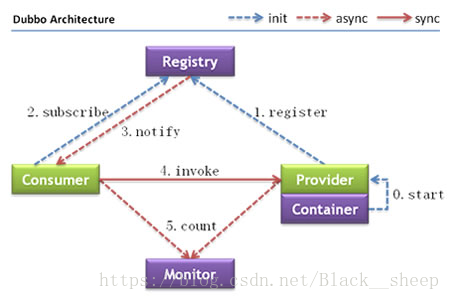
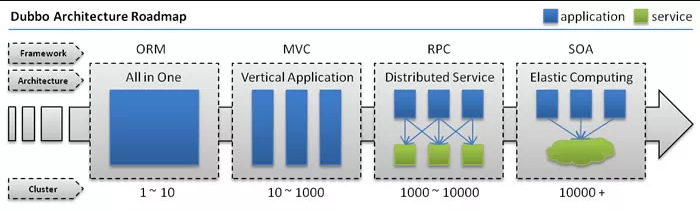
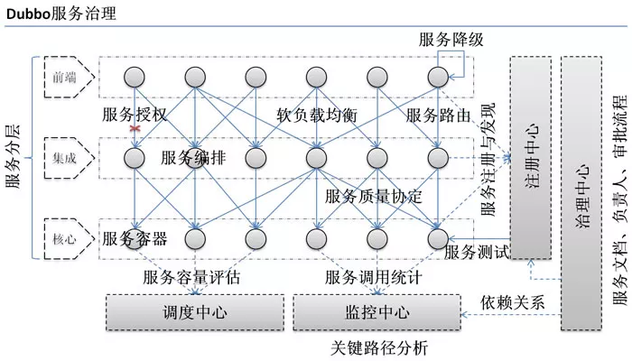
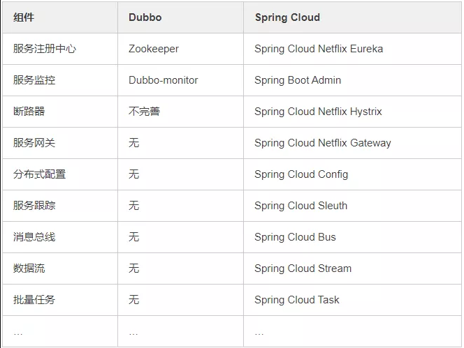
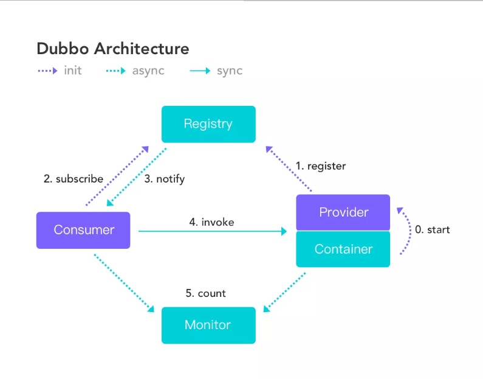
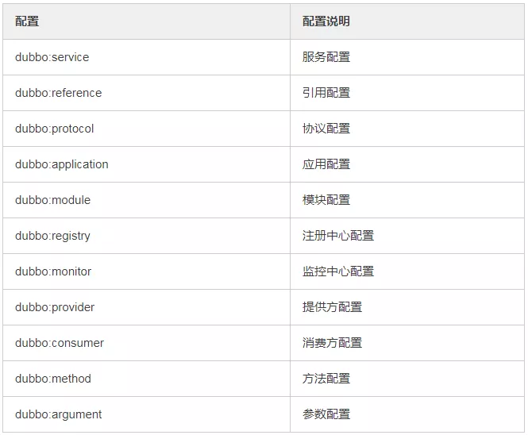
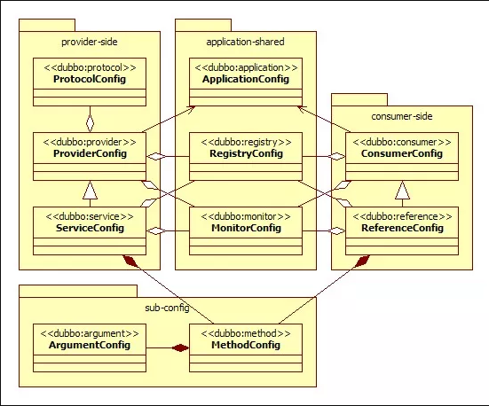
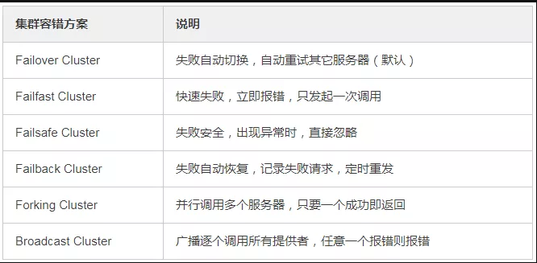
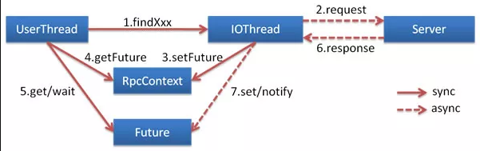
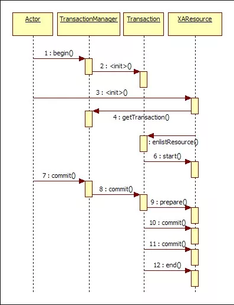

# Dubbo 分布式服务

## Dubbo架构




节点角色说明：
- Provider: 暴露服务的服务提供方。
- Consumer: 调用远程服务的服务消费方。
- Registry: 服务注册与发现的注册中心。
- Monitor: 统计服务的调用次调和调用时间的监控中心。
- Container: 服务运行容器。

调用关系说明：
- 0：服务容器负责启动，加载，运行服务提供者。
- 1：服务提供者在启动时，向注册中心注册自己提供的服务。
- 2：服务消费者在启动时，向注册中心订阅自己所需的服务。
- 3：注册中心返回服务提供者地址列表给消费者，如果有变更，注册中心将基于长连接推送变更数据给消费者。
- 4：服务消费者，从提供者地址列表中，基于软负载均衡算法，选一台提供者进行调用，如果调用失败，再选另一台调用。
- 5：服务消费者和提供者，在内存中累计调用次数和调用时间，定时每分钟发送一次统计数据到监控中心。

## Dubbo的超时机制：

#### 超时机制

Dubbo是阿里开源的分布式远程调用方案(RPC)，由于网络或服务端不可靠，会导致调用出现一种不确定的中间状态（超时）。为了避免超时导致客户端资源（线程）挂起耗尽，必须设置超时时间。

Provider可以配置的Consumer端主要属性有timeout、retries、loadbalance、actives和cluster。

Provider上应尽量多配置些Consumer端的属性，让Provider实现者一开始就思考Provider的服务特点与服务质量。配置之间存在着覆盖，具体规则如下： 
1. 方法级配置优于接口级别，即小Scope优先 
2. Consumer消费者端配置优于Provider服务提供方配置，优于全局配置 
3. Dubbo Hard Code的配置值（默认）

服务提供方配置，通过URL经由注册中心传递给消费方。

建议由服务提供方设置超时，因为一个方法需要执行多长时间，服务提供方更清楚。如果一个消费方同时引用多个服务，不需要关心每个服务的超时时间。

根据规则2，纵使消费端配置优于服务端配置，但消费端配置超时时间不能随心所欲，需要根据业务实际情况来设定。如果超时时间设置得太短，复杂业务本来就需要很长时间完成，服务端无法在设定的超时时间内完成业务处理；如果超时时间设置太长，会由于服务端或者网络问题导致客户端资源大量线程挂起。

#### 超时配置

##### Dubbo消费端 
``` text 
全局超时配置
<dubbo:consumer timeout="5000" />
指定接口以及特定方法超时配置
<dubbo:reference interface="com.foo.BarService" timeout="2000">
<dubbo:method name="sayHello" timeout="3000" />
</dubbo:reference>
```

##### Dubbo服务端
``` text 
全局超时配置
<dubbo:provider timeout="5000" />
指定接口以及特定方法超时配置
<dubbo:provider interface="com.foo.BarService" timeout="2000">
<dubbo:method name="sayHello" timeout="3000" />
</dubbo:provider>
```

dubbo 重试机制 retires 默认2次

假设服务端设置为 <dubbo:provider delay="-1"  timeout="9000" retries="2"></dubbo:provider>，客户端不进行设置。

consumer调用 provider的 insert 服务时，本次调用由于某种原因 provider没能在50秒内完成（假设provider的 insert 需要60 秒完成），consumer 会发起第一个重复请求，此次请求还是没有结果（因为 provider 60秒才能完成），第二次重复发起请求，依然没有结果。此时会返回一个com.alibaba.dubbo.remoting.TimeoutException ，但 provider 却执行了总共三次的操作（其中retire 2次），此时可以设置 客户端  设置该insert方法 的 retire 为 0：
``` text 
<dubbo:reference interface="com.xxx.content.service.ContentService" id="contentService" >
    <dubbo:method name="insert" retries="0"></dubbo:method>
</dubbo:reference>
```


## 关于Dubbo的几个问题

#### 1、Dubbo是什么？

Dubbo是阿里巴巴开源的基于 Java 的高性能 RPC 分布式服务框架，现已成为 Apache 基金会孵化项目。

官网：http://dubbo.apache.org

#### 2、为什么要用Dubbo？

因为是阿里开源项目，国内很多互联网公司都在用，已经经过很多线上考验。内部使用了 Netty、Zookeeper，保证了高性能高可用性。

使用 Dubbo 可以将核心业务抽取出来，作为独立的服务，逐渐形成稳定的服务中心，可用于提高业务复用灵活扩展，使前端应用能更快速的响应多变的市场需求。

下面这张图可以很清楚的诠释，最重要的一点是，分布式架构可以承受更大规模的并发流量。



下面是 Dubbo 的服务治理图。



#### 3、Dubbo 和 Spring Cloud 有什么区别？

两个没关联，如果硬要说区别，有以下几点。

1）通信方式不同

Dubbo 使用的是 RPC 通信，而 Spring Cloud 使用的是 HTTP RESTFul 方式。

2）组成部分不同



#### 4、dubbo都支持什么协议，推荐用哪种？

```text
dubbo://（推荐）
rmi://
hessian://
http://
webservice://
thrift://
memcached://
redis://
rest://
```

#### 5、Dubbo需要 Web 容器吗？

不需要，如果硬要用 Web 容器，只会增加复杂性，也浪费资源。

#### 6、Dubbo内置了哪几种服务容器？

- Spring Container
- Jetty Container
- Log4j Container

Dubbo 的服务容器只是一个简单的 Main 方法，并加载一个简单的 Spring 容器，用于暴露服务。


#### 7、Dubbo里面有哪几种节点角色？


#### 8、画一画服务注册与发现的流程图



该图来自 Dubbo 官网，供你参考，如果你说你熟悉 Dubbo, 面试官经常会让你画这个图，记好了。

#### 9、Dubbo默认使用什么注册中心，还有别的选择吗？

推荐使用 Zookeeper 作为注册中心，还有 Redis、Multicast、Simple 注册中心，但不推荐。

#### 10、Dubbo有哪几种配置方式？

1）Spring 配置方式

2）Java API 配置方式

#### 11、Dubbo 核心的配置有哪些？

我曾经面试就遇到过面试官让你写这些配置，我也是蒙逼。。



配置之间的关系见下图。



#### 12、在 Provider 上可以配置的 Consumer 端的属性有哪些？

1）timeout：方法调用超时

2）retries：失败重试次数，默认重试 2 次

3）loadbalance：负载均衡算法，默认随机

4）actives 消费者端，最大并发调用限制

#### 13、Dubbo启动时如果依赖的服务不可用会怎样？

Dubbo 缺省会在启动时检查依赖的服务是否可用，不可用时会抛出异常，阻止 Spring 初始化完成，默认 check="true"，可以通过 check="false" 关闭检查。

#### 14、Dubbo推荐使用什么序列化框架，你知道的还有哪些？

推荐使用Hessian序列化，还有Duddo、FastJson、Java自带序列化。

#### 15、Dubbo默认使用的是什么通信框架，还有别的选择吗？

Dubbo 默认使用 Netty 框架，也是推荐的选择，另外内容还集成有Mina、Grizzly。

#### 16、Dubbo有哪几种集群容错方案，默认是哪种？



#### 17、Dubbo有哪几种负载均衡策略，默认是哪种？


#### 18、注册了多个同一样的服务，如果测试指定的某一个服务呢？

可以配置环境点对点直连，绕过注册中心，将以服务接口为单位，忽略注册中心的提供者列表。

#### 19、Dubbo支持服务多协议吗？

Dubbo 允许配置多协议，在不同服务上支持不同协议或者同一服务上同时支持多种协议。

#### 20、当一个服务接口有多种实现时怎么做？

当一个接口有多种实现时，可以用 group 属性来分组，服务提供方和消费方都指定同一个 group 即可。

#### 21、服务上线怎么兼容旧版本？

可以用版本号（version）过渡，多个不同版本的服务注册到注册中心，版本号不同的服务相互间不引用。这个和服务分组的概念有一点类似。

#### 22、Dubbo可以对结果进行缓存吗？

可以，Dubbo 提供了声明式缓存，用于加速热门数据的访问速度，以减少用户加缓存的工作量。

#### 23、Dubbo服务之间的调用是阻塞的吗？

默认是同步等待结果阻塞的，支持异步调用。

Dubbo 是基于 NIO 的非阻塞实现并行调用，客户端不需要启动多线程即可完成并行调用多个远程服务，相对多线程开销较小，异步调用会返回一个 Future 对象。

异步调用流程图如下。



#### 24、Dubbo支持分布式事务吗？

目前暂时不支持，后续可能采用基于 JTA/XA 规范实现，如以图所示。



#### 25、Dubbo telnet 命令能做什么？

dubbo 通过 telnet 命令来进行服务治理，具体使用看这篇文章《dubbo服务调试管理实用命令》。

telnet localhost 8090

#### 26、Dubbo支持服务降级吗？

Dubbo 2.2.0 以上版本支持。

#### 27、Dubbo如何优雅停机？

Dubbo 是通过 JDK 的 ShutdownHook 来完成优雅停机的，所以如果使用 kill -9 PID 等强制关闭指令，是不会执行优雅停机的，只有通过 kill PID 时，才会执行。

#### 28、服务提供者能实现失效踢出是什么原理？

服务失效踢出基于 Zookeeper 的临时节点原理。

#### 29、如何解决服务调用链过长的问题？

Dubbo 可以使用 Pinpoint 和 Apache Skywalking(Incubator) 实现分布式服务追踪，当然还有其他很多方案。

#### 30、服务读写推荐的容错策略是怎样的？

读操作建议使用 Failover 失败自动切换，默认重试两次其他服务器。

写操作建议使用 Failfast 快速失败，发一次调用失败就立即报错。

#### 31、Dubbo必须依赖的包有哪些？

Dubbo 必须依赖 JDK，其他为可选。

#### 32、Dubbo的管理控制台能做什么？

管理控制台主要包含：路由规则，动态配置，服务降级，访问控制，权重调整，负载均衡，等管理功能。

#### 33、说说 Dubbo 服务暴露的过程。

Dubbo 会在 Spring 实例化完 bean 之后，在刷新容器最后一步发布 ContextRefreshEvent 事件的时候，通知实现了 ApplicationListener 的 ServiceBean 类进行回调 onApplicationEvent 事件方法，Dubbo 会在这个方法中调用 ServiceBean 父类 ServiceConfig 的 export 方法，而该方法真正实现了服务的（异步或者非异步）发布。

#### 34、Dubbo 停止维护了吗？

2014 年开始停止维护过几年，17 年开始重新维护，并进入了 Apache 项目。

#### 35、Dubbo 和 Dubbox 有什么区别？

Dubbox 是继 Dubbo 停止维护后，当当网基于 Dubbo 做的一个扩展项目，如加了服务可 Restful 调用，更新了开源组件等。

#### 36、你还了解别的分布式框架吗？

别的还有 Spring cloud、Facebook 的 Thrift、Twitter 的 Finagle 等。

#### 37、Dubbo 能集成 Spring Boot 吗？

可以的，项目地址如下。

https://github.com/apache/incubator-dubbo-spring-boot-project

#### 38、在使用过程中都遇到了些什么问题？

Dubbo 的设计目的是为了满足高并发小数据量的 rpc 调用，在大数据量下的性能表现并不好，建议使用 rmi 或 http 协议。

#### 39、你读过 Dubbo 的源码吗？

要了解 Dubbo 就必须看其源码，了解其原理，花点时间看下吧，网上也有很多教程，后续有时间我也会在公众号上分享 Dubbo 的源码。

#### 40、你觉得用 Dubbo 好还是 Spring Cloud 好？

扩展性的问题，没有好坏，只有适合不适合，不过我好像更倾向于使用 Dubbo, Spring Cloud 版本升级太快，组件更新替换太频繁，配置太繁琐，还有很多我觉得是没有 Dubbo 顺手的地方……
