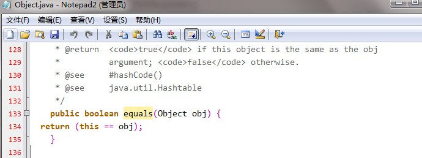
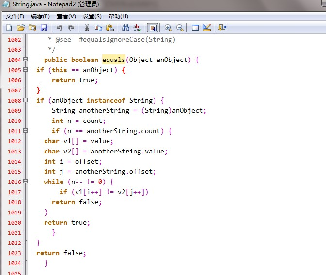

# equals和==

== 运算符，操作基本数据类型和引用数据类型，如果是基本数据类型，比较“值”，如果引用类型，比较内存地址。

equals 是Object方法，Object中equals 用的就是 == ，继承Object的类 都会有该方法，String等对equals进行重写，比较的是数据内容


## 浅谈Java中的equals和==
在初学Java时，可能会经常碰到下面的代码：
```text
String str1 = new String("hello");
String str2 = new String("hello");

System.out.println(str1==str2);
System.out.println(str1.equals(str2));
```

为什么第4行和第5行的输出结果不一样？==和equals方法之间的区别是什么？如果在初学Java的时候这个问题不弄清楚，就会导致自己在以后编写代码时出现一些低级的错误。今天就来一起了解一下==和equals方法的区别之处。

#### 一. 关系操作符“==”到底比较的是什么？

下面这个句话是摘自《Java编程思想》一书中的原话：
> “关系操作符生成的是一个boolean结果，它们计算的是操作数的值之间的关系”。

这句话看似简单，理解起来还是需要细细体会的。说的简单点，==就是用来比较值是否相等。下面先看几个例子：
``` text 
public class Main {

    /**
     * @param args
     */
    public static void main(String[] args) {
        // TODO Auto-generated method stub
        
        int n=3;
        int m=3;
        
        System.out.println(n==m);
        
        String str = new String("hello");
        String str1 = new String("hello");
        String str2 = new String("hello");
        
        System.out.println(str1==str2);
        
        str1 = str;
        str2 = str;
        System.out.println(str1==str2);
    }

}
```

输出结果为 true false true

n==m结果为true，这个很容易理解，变量n和变量m存储的值都为3，肯定是相等的。而为什么str1和str2两次比较的结果不同？要理解这个其实只需要理解基本数据类型变量和非基本数据类型变量的区别。

在Java中游8种基本数据类型：

浮点型：float(4 byte), double(8 byte)

整型：byte(1 byte), short(2 byte), int(4 byte) , long(8 byte)

字符型: char(2 byte)

布尔型: boolean(JVM规范没有明确规定其所占的空间大小，仅规定其只能够取字面值"true"和"false")

对于这8种基本数据类型的变量，变量直接存储的是“值”，因此在用关系操作符==来进行比较时，比较的就是 “值” 本身。要注意浮点型和整型都是有符号类型的，而char是无符号类型的（char类型取值范围为0~2^16-1).

也就是说比如：
``` text 
　　int n=3;
　　int m=3;　
```

变量n和变量m都是直接存储的"3"这个数值，所以用==比较的时候结果是true。

而对于非基本数据类型的变量，在一些书籍中称作为 引用类型的变量。比如上面的str1就是引用类型的变量，引用类型的变量存储的并不是 “值”本身，而是于其关联的对象在内存中的地址。比如下面这行代码：
``` text 
　　String str1;
``` 

这句话声明了一个引用类型的变量，此时它并没有和任何对象关联。

而 通过new String("hello")来产生一个对象（也称作为类String的一个实例），并将这个对象和str1进行绑定：
``` text 
　　str1= new String("hello");
```

那么str1指向了一个对象（很多地方也把str1称作为对象的引用），此时变量str1中存储的是它指向的对象在内存中的存储地址，并不是“值”本身，也就是说并不是直接存储的字符串"hello"。这里面的引用和C/C++中的指针很类似。

因此在用==对str1和str2进行第一次比较时，得到的结果是false。因此它们分别指向的是不同的对象，也就是说它们实际存储的内存地址不同。

而在第二次比较时，都让str1和str2指向了str指向的对象，那么得到的结果毫无疑问是true。

#### 二.equals比较的又是什么？

equals方法是基类Object中的方法，因此对于所有的继承于Object的类都会有该方法。为了更直观地理解equals方法的作用，直接看Object类中equals方法的实现。

该类的源码路径为：C:\Program Files\Java\jdk1.6.0_14的src.zip 的java.lang路径下的Object.java（视个人jdk安装路径而定）。

下面是Object类中equals方法的实现：



很显然，在Object类中，equals方法是用来比较两个对象的引用是否相等，即是否指向同一个对象。

但是有些朋友又会有疑问了，为什么下面一段代码的输出结果是true？
``` text 
public class Main {

    /**
     * @param args
     */
    public static void main(String[] args) {
        // TODO Auto-generated method stub
        
        String str1 = new String("hello");
        String str2 = new String("hello");
        
        System.out.println(str1.equals(str2));
    }
}
```

要知道究竟，可以看一下String类的equals方法的具体实现，同样在该路径下，String.java为String类的实现。

下面是String类中equals方法的具体实现：



可以看出，String类对equals方法进行了重写，用来比较指向的字符串对象所存储的字符串是否相等。

其他的一些类诸如Double，Date，Integer等，都对equals方法进行了重写用来比较指向的对象所存储的内容是否相等。

总结来说：

1）对于==，如果作用于基本数据类型的变量，则直接比较其存储的 “值”是否相等；
如果作用于引用类型的变量，则比较的是所指向的对象的地址

2）对于equals方法，注意：equals方法不能作用于基本数据类型的变量。
如果没有对equals方法进行重写，则比较的是引用类型的变量所指向的对象的地址；
诸如String、Date等类对equals方法进行了重写的话，比较的是所指向的对象的内容。