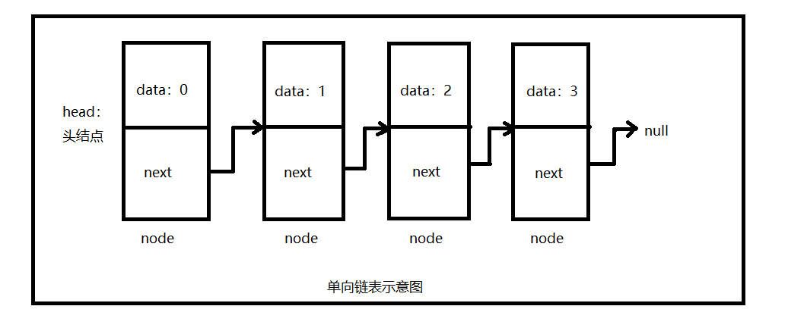
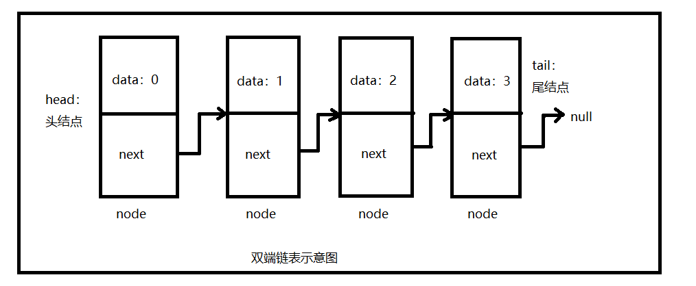
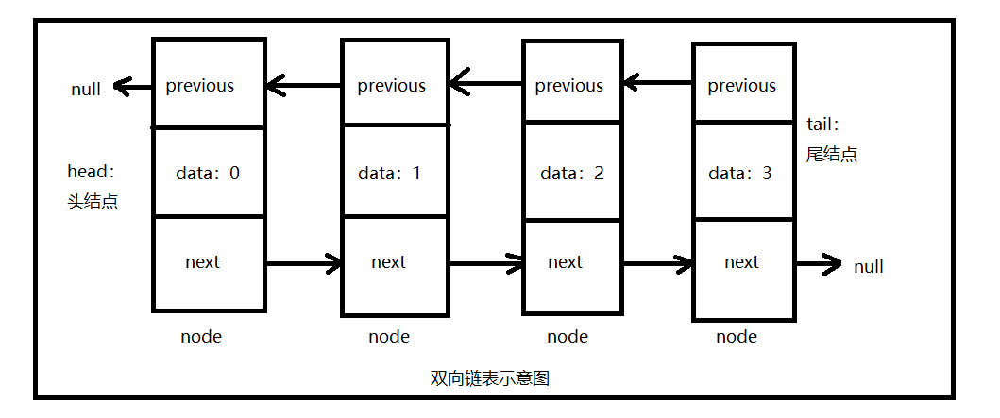

# 链表

> 一种递归的数据结构，null / 指向一个节点的引用。无序

### 单向链表
节点node（数据data、下一个节点的地址next），最后一个节点指向null。
- 一般在链表表头插入元素。
- key用单向链表实现 栈，后进先出。 

### 双端链表
- 头节点，尾节点
- 方便两端插入元素
- 可以用双端链表实现队列。先进先出。

### 有序链表
- 插入时不需要移动元素。

### 双向链表
- 每个节点可以指向上一个节点，也可以指向下一个节点。

