#### Servlet 生命周期
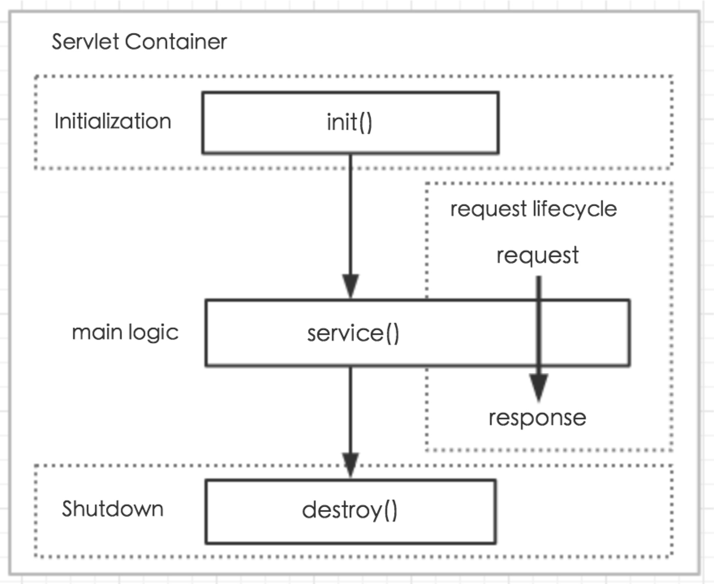

Servlet 是用 Java 编写的服务器端程序。其主要功能在于交互式地浏览和修改数据，生成动态 Web 内容。

1. 请求到达 server 端，server 根据 url 映射到相应的 Servlet
2. 判断 Servlet 实例是否存在，不存在则加载和实例化 Servlet 并调用 init 方法
3. Server 分别创建 Request 和 Response 对象，调用 Servlet 实例的 service 方法(service 方法 内部会根据 http 请求方法类型调用相应的 doXXX 方法)
4. doXXX 方法内为业务逻辑实现，从 Request 对象获取请求参数，处理完毕之后将结果通过 response 对象返回给调用方
5. 当 Server 不再需要 Servlet 时(一般当 Server 关闭时)，Server 调用 Servlet 的 destroy() 方 法。

load on startup

当值为 0 或者大于 0 时，表示容器在应用启动时就加载这个 servlet; 当是一个负数时或者没有指定时，则指示容器在该 servlet 被选择时才加载; 正数的值越小，启动该 servlet 的优先级越高;

single thread model

每次访问 servlet，新建 servlet 实体对象，但并不能保证线程安全，同时 tomcat 会限制 servlet 的实例数目

最佳实践：不要使用该模型，servlet 中不要有全局变量

#### 请求处理过程
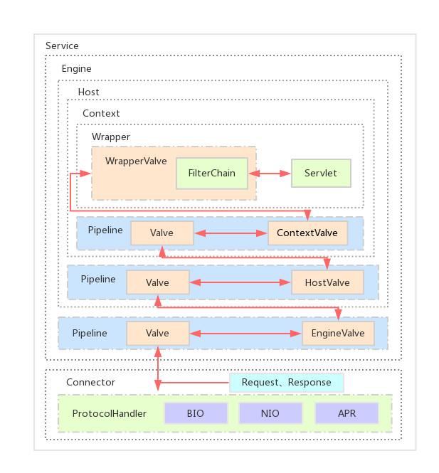

1. 根据 server.xml 配置的指定的 connector 以及端口监听 http、或者 ajp 请求
2. 请求到来时建立连接,解析请求参数,创建 Request 和 Response 对象,调用顶层容器 pipeline 的 invoke 方法
3. 容器之间层层调用,最终调用业务 servlet 的 service 方法
4. Connector 将 response 流中的数据写到 socket 中

#### Pipeline 与 Valve
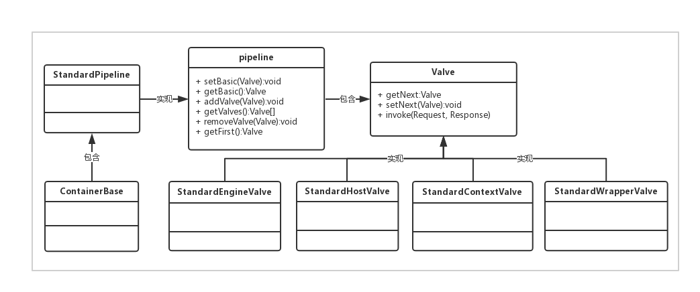

Pipeline 可以理解为现实中的管道,Valve 为管道中的阀门,Request 和 Response 对象在管道中 经过各个阀门的处理和控制。

每个容器的管道中都有一个必不可少的 basic valve,其他的都是可选的,basic valve 在管道中最 后调用,同时负责调用子容器的第一个 valve。

Valve 中主要的三个方法:setNext、getNext、invoke;valve 之间的关系是单向链式结构,本身 invoke 方法中会调用下一个 valve 的 invoke 方法。

各层容器对应的 basic valve 分别是 StandardEngineValve、StandardHostValve、 StandardContextValve、StandardWrapperValve。

## JSP引擎
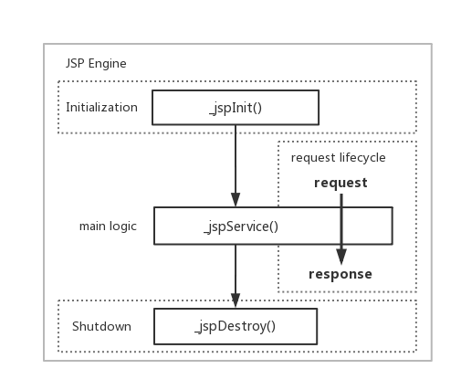

#### JSP 生命周期
     
- 编译阶段:servlet 容器编译 servlet 源文件,生成 servlet 类
- 初始化阶段:加载与 JSP 对应的 servlet 类, 创建其实例,并调用它的初始化方法
- 执行阶段:调用与 JSP 对应的 servlet 实例的 服务方法
- 销毁阶段:调用与 JSP 对应的 servlet 实例的 销毁方法,然后销毁 servlet 实例

#### JSP元素
 
 - 代码片段： <% 代码片段 %>
 - JSP声明： <%! declaration; [ declaration; ]+ ... %>
 - JSP表达式：<%= 表达式 %>
 - JSP注释： <%-- 注释 --%>
 - JSP指令： <%@ directive attribute=“value” %>
 - JSP行为： <jsp:action_name attribute="“value”">HTML元素： html/head/body/div/p/…
 - JSP隐式对象：request、response、out、session、application、config、
 - pageContext、page、Exception</jsp:action_name>
 
#### JSP 元素说明
 - 代码片段:包含任意量的 Java 语句、变量、方法或表达式;
 - JSP 声明:一个声明语句可以声明一个或多个变量、方法,供后面的 Java 代码使用;
 - JSP 表达式:输出 Java 表达式的值,String 形式;
 - JSP 注释:为代码作注释以及将某段代码注释掉
 - JSP 指令:用来设置与整个 JSP 页面相关的属性,
 - <%@ page ... %>定义页面的依赖属性,比如 language、contentType、errorPage、 isErrorPage、import、isThreadSafe、session 等等
 - <%@ include ... %>包含其他的 JSP 文件、HTML 文件或文本文件,是该 JSP 文件的一部分,会 被同时编译执行
 - <%@ taglib ... %>引入标签库的定义,可以是自定义标签
 - JSP 行为:jsp:include、jsp:useBean、jsp:setProperty、jsp:getProperty、jsp:forward
 
#### Jsp 解析过程
 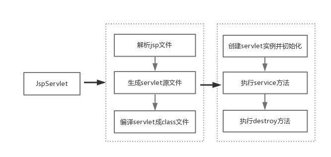
 
 - 代码片段:在_jspService()方法内直接输出
 - JSP 声明: 在 servlet 类中进行输出
 - JSP 表达式:在_jspService()方法内直接输出
 - JSP 注释:直接忽略,不输出
 - JSP 指令:根据不同指令进行区分,include:对引入的文件进行解析;page 相关的属性会做为 JSP 的属性,影响的是解析和请求处理时的行为
 - JSP 行为:不同的行为有不同的处理方式,jsp:useBean 为例,会从 pageContext 根据 scope 的 类别获取 bean 对象,如果没有会创建 bean,同时存到相应 scope 的 pageContext 中
 - HTML:在_jspService()方法内直接输出
 - JSP 隐式对象:在_jspService()方法会进行声明,只能在方法中使用;
 
## Connector
 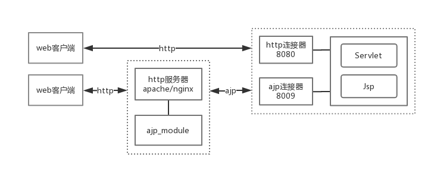
 
 - Http:HTTP 是超文本传输协议,是客户端浏览器或其他程序与 Web 服务器之间的应用层通信协 议
 - AJP:Apache JServ 协议(AJP)是一种二进制协议,专门代理从 Web 服务器到位于后端的应用 程序服务器的入站请求
 
#### 阻塞 IO
 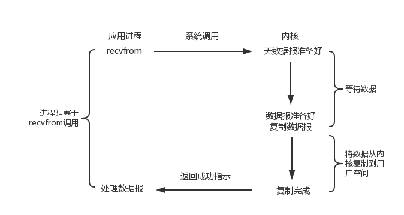
 
#### 非阻塞 IO
 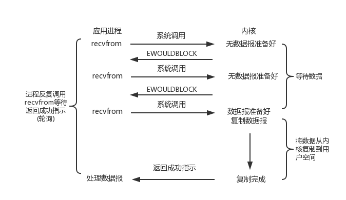
 
#### IO多路复用
 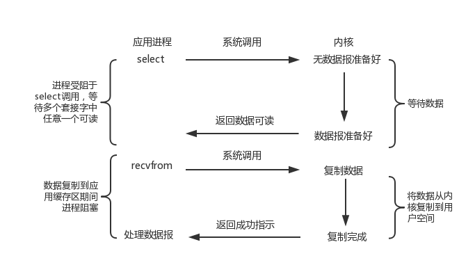
 
 阻塞与非阻塞的区别在于进行读操作和写操作的系统调用时，如果此时内核态没有数据可读或者没有缓冲空间可写时，是否阻塞。
 
 IO多路复用的好处在于可同时监听多个socket的可读和可写事件，这样就能使得应用可以同时监听多个socket，释放了应用线程资源。
 
#### Tomcat各类Connector对比
 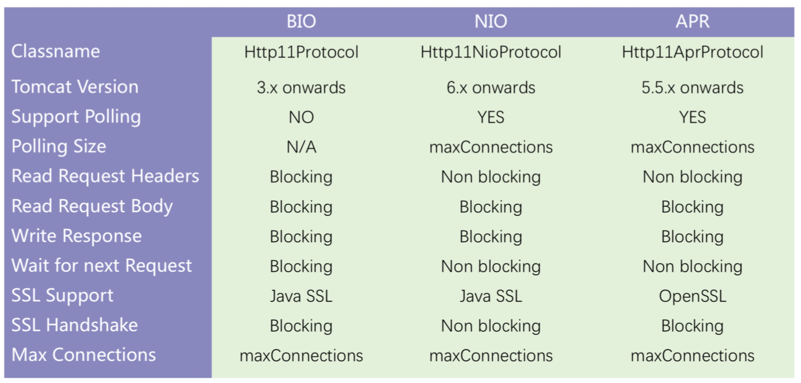
 
 Connector的实现模式有三种，分别是BIO、NIO、APR，可以在server.xml中指定。
 
 - JIO：用java.io编写的TCP模块，阻塞IO
 - NIO：用java.nio编写的TCP模块，非阻塞IO，（IO多路复用）
 - APR：全称Apache Portable Runtime，使用JNI的方式来进行读取文件以及进行网络传输
 
 Apache Portable Runtime是一个高度可移植的库，它是Apache HTTP Server 2.x的核心。 APR具有许多用途，包括访问高级IO功能（如sendfile，epoll和OpenSSL），操作系统级功能（随机数生成，系统状态等）和本地进程处理（共享内存，NT管道和Unix套接字）。
 
 表格中字段含义说明：
 - Support Polling：是否支持基于IO多路复用的socket事件轮询
 - Polling Size：轮询的最大连接数
 - Wait for next Request：在等待下一个请求时，处理线程是否释放，BIO是没有释放的，所以在keep-alive=true的情况下处理的并发连接数有限
 - Read Request Headers：由于request header数据较少，可以由容器提前解析完毕，不需要阻塞
 - Read Request Body：读取request body的数据是应用业务逻辑的事情，同时Servlet的限制，是需要阻塞读取的
 - Write Response：跟读取request body的逻辑类似，同样需要阻塞写
 
#### NIO处理相关类
 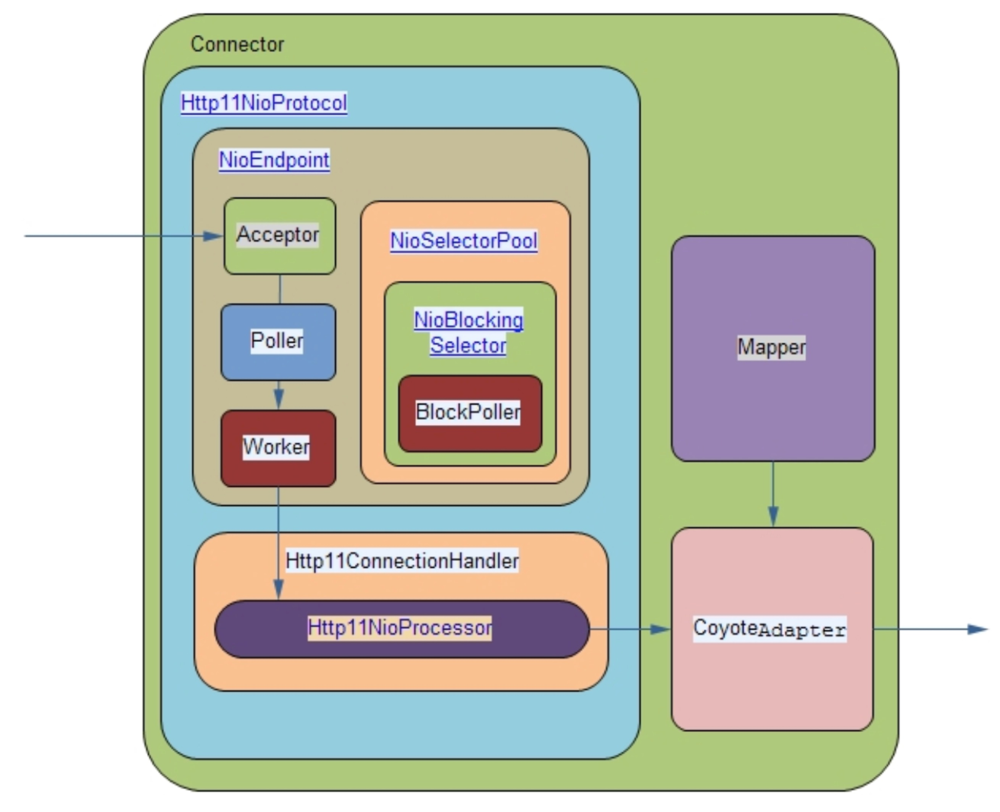
 
 - Acceptor线程负责接收连接，调用accept方法阻塞接收建立的连接，并对socket进行封装成PollerEvent，指定注册的事件为op_read，并放入到EventQueue队列中，PollerEvent的run方法逻辑的是将Selector注册到socket的指定事件；
 - Poller线程从EventQueue获取PollerEvent，并执行PollerEvent的run方法，调用Selector的select方法，如果有可读的Socket则创建Http11NioProcessor，放入到线程池中执行；
 - CoyoteAdapter是Connector到Container的适配器，Http11NioProcessor调用其提供的service方法，内部创建Request和Response对象，并调用最顶层容器的Pipeline中的第一个Valve的invoke方法
 - Mapper主要处理http url 到servlet的映射规则的解析，对外提供map方法
 
#### NIO Connector主要参数
 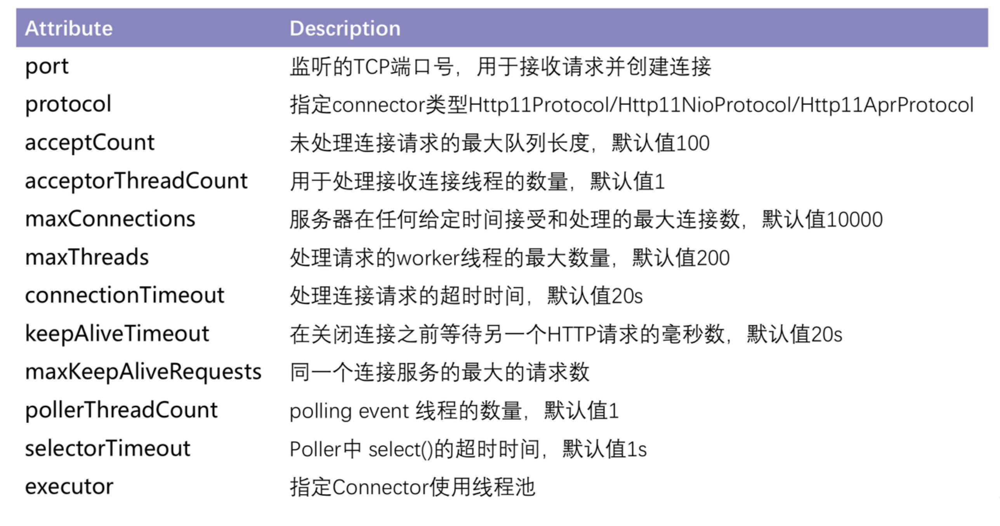     

## 异步Servlet
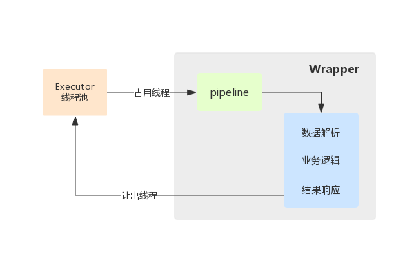

传统流程：
- 首先，Servlet 接收到请求之后，request数据解析；
- 接着，调用业务接口的某些方法，以完成业务处理；
- 最后，根据处理的结果提交响应，Servlet 线程结束。

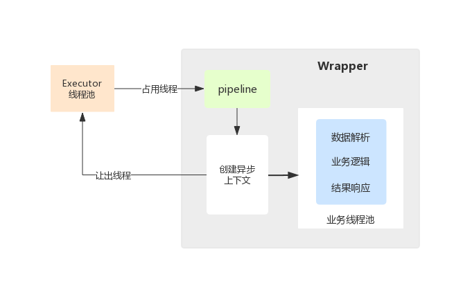
异步处理流程：
- 客户端发送一个请求
- Servlet容器分配一个线程来处理容器中的一个servlet
- servlet调用request.startAsync()，保存AsyncContext, 然后返回
- 任何方式存在的容器线程都将退出，但是response仍然保持开放
- 业务线程使用保存的AsyncContext来完成响应（线程池）
- 客户端收到响应

Servlet 线程将请求转交给一个异步线程来执行业务处理，线程本身返回至容器，此时 Servlet 还没有生成响应数据，异步线程处理完业务以后，可以直接生成响应数据（异步线程拥有 ServletRequest 和 ServletResponse 对象的引用）

#### 为什么web应用中支持异步？

推出异步，主要是针对那些比较耗时的请求：比如一次缓慢的数据库查询，一次外部REST API调用, 或者是其他一些I/O密集型操作。这种耗时的请求会很快的耗光Servlet容器的线程池，继而影响可扩展性。

Note：从客户端的角度来看，request仍然像任何其他的HTTP的request-response交互一样，只是耗费了更长的时间而已
 
#### 异步事件监听
- onStartAsync：Request调用startAsync方法时触发
- onComplete：syncContext调用complete方法时触发
- onError：处理请求的过程出现异常时触发
- onTimeout：socket超时触发

Note :
- onError/ onTimeout触发后，会紧接着回调onComplete
- onComplete 执行后，就不可再操作request和response
